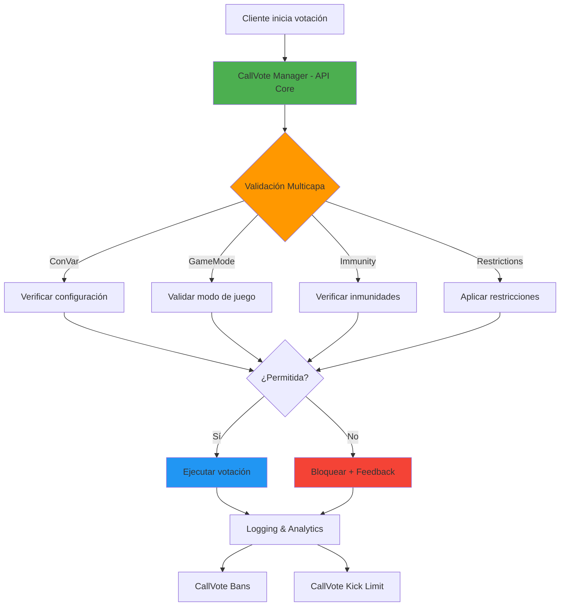

# CallVote Manager Suite

[](LICENSE)
[](https://www.sourcemod.net/)
[](https://github.com/AoC-Gamers/CallVote-Manager/releases)
[](https://store.steampowered.com/app/550/Left_4_Dead_2/)

**Suite completa de administración avanzada de votaciones para servidores Left 4 Dead 2**

---

## � **Descripción General**

CallVote Manager Suite es un **ecosistema modular** de plugins SourceMod diseñado para proporcionar control total sobre el sistema de votaciones en servidores Left 4 Dead 2. La suite intercepta, valida y gestiona todas las votaciones antes de que lleguen al motor del juego, ofreciendo un control granular sin precedentes.

### **Arquitectura del Sistema**



---

## 📦 **Componentes de la Suite**

### 🎯 **[CallVote Manager](docs/README_MANAGER.md)** - API Principal
**El núcleo del sistema que actúa como API central para toda la gestión de votaciones.**

- 🔧 **API nativa** para integración con otros plugins
- 🛡️ **Sistema de inmunidades** configurable
- 📊 **Logging dual** (archivos + SQL)
- 🌍 **Localización inteligente** con traducciones dinámicas
- ⚡ **Optimizado** con cache y lookups O(1)

### 🚫 **[CallVote Kick Limit](docs/README_KICKLIMIT.md)** - Control de Abuso
**Previene el spam y abuso de votaciones de expulsión con límites inteligentes.**

- ⏱️ **Límites temporales** por jugador y mapa
- 💾 **Persistencia en BD** para reiniciar servidor
- 📈 **Estadísticas** detalladas para administradores
- 🔄 **Integración** con CallVote Manager API

### 🔒 **[CallVote Bans](docs/README_BANS.md)** - Sistema de Restricciones
**Sistema avanzado para restringir jugadores de tipos específicos de votaciones.**

- 🎯 **Bans selectivos** por tipo de votación
- ⏰ **Duraciones flexibles** (temporal/permanente)
- 🔗 **API extendida** para otros plugins
- 🗃️ **Gestión avanzada** de base de datos

---

## 🚀 **Inicio Rápido**

### **Instalación Básica**
1. Descarga la [última versión](https://github.com/AoC-Gamers/CallVote-Manager/releases)
2. Extrae los archivos en tu directorio SourceMod
3. Reinicia el servidor o carga los plugins

### **Configuración Mínima**
```sourcepawn
// Habilitar gestión básica de votaciones
sm_cvm_enable "1"

// Configurar inmunidad administrativa
sm_cvm_admininmunity "z"  // Flags de inmunidad

// Habilitar logging
sm_cvm_log "127"  // Registrar todos los tipos
```

---

## 📚 **Documentación Detallada**

| Plugin | Documentación | Estado |
|--------|---------------|--------|
| **CallVote Manager** | [📖 docs/README_MANAGER.md](docs/README_MANAGER.md) | ✅ Actualizada |
| **CallVote Kick Limit** | [📖 docs/README_KICKLIMIT.md](docs/README_KICKLIMIT.md) | 🔄 En desarrollo |
| **CallVote Bans** | [📖 docs/README_BANS.md](docs/README_BANS.md) | ✅ Actualizada |

---

## 🤝 **Para Desarrolladores**

La suite proporciona una **API robusta** para integración:

```sourcepawn
// Forwards disponibles
CallVote_PreStart(client, voteType, target);
CallVote_Start(client, voteType, target);
CallVote_PreExecute(client, voteType, target);
CallVote_Blocked(client, voteType, restriction, target);

// Natives para validación
bool CallVoteManager_IsVoteAllowedByConVar(TypeVotes voteType);
bool CallVoteManager_IsVoteAllowedByGameMode(TypeVotes voteType);
```

**[📖 Ver documentación completa de API →](docs/README_MANAGER.md#api-para-desarrolladores)**

**Características principales:**
- ✅ **Cache multinivel** optimizado (StringMap + SQLite + MySQL)
- ✅ **Bans selectivos** por tipo de votación (kick, restart, mission, etc.)
- ✅ **API v2.0 expandida** con 12+ natives y forwards automáticos
- ✅ **Procedimientos almacenados** para máximo rendimiento
- ✅ **Sistema de razones** configurable y extensible
- ✅ **Soporte universal** de formatos SteamID
- ✅ **Panel administrativo** interactivo con menús

**[📖 Ver documentación completa →](README_BANS.md)**

---

## 🚀 **Instalación Rápida**

### **1. Descargar Archivos**
```bash
# Clonar repositorio
git clone https://github.com/lechuga16/callvote_manager.git

# O descargar release
wget https://github.com/lechuga16/callvote_manager/releases/latest
```

### **2. Instalar Plugins**
```bash
# Copiar archivos compilados
addons/sourcemod/plugins/callvote/callvotemanager.smx     # Plugin principal
addons/sourcemod/plugins/callvote/callvote_kicklimit.smx  # Control de kicks
addons/sourcemod/plugins/callvote/callvote_bans.smx       # Sistema de bans

# Copiar configuraciones
addons/sourcemod/configs/callvote_ban_reasons.cfg
addons/sourcemod/configs/sql-init-callvote/
addons/sourcemod/translations/callvote_*.phrases.txt
addons/sourcemod/scripting/include/callvotemanager.inc
addons/sourcemod/scripting/include/callvote_stock.inc
addons/sourcemod/scripting/include/callvote_bans.inc
```

### **Artefacto generado por CI**
El workflow genera un artefacto instalable con este layout:

```text
addons/sourcemod/plugins/callvote/
    callvotemanager.smx
    callvote_kicklimit.smx
    callvote_bans.smx
addons/sourcemod/scripting/include/
    callvotemanager.inc
    callvote_stock.inc
    callvote_bans.inc
addons/sourcemod/configs/
    callvote_ban_reasons.cfg
    sql-init-callvote/
addons/sourcemod/translations/
    callvote*.phrases.txt
    es/callvote*.phrases.txt
```

### **3. Configurar Base de Datos** *(Opcional - Solo para funciones SQL)*
```ini
# En addons/sourcemod/configs/databases.cfg
"callvote"
{
    "driver"    "mysql"
    "host"      "localhost" 
    "database"  "sourcemod"
    "user"      "root"
    "pass"      "password"
}
```

### **4. Activar Plugins**
```bash
# En consola del servidor
sm plugins load callvotemanager
sm plugins load callvote_kicklimit  
sm plugins load callvote_bans

# Instalar tablas (si usas MySQL)
sm_cv_sql_install       # Call Vote Manager
sm_ckl_sql_install      # Kick Limit
sm_cvb_install force    # Call Vote Bans
```

---

## ⚙️ **Configuración Básica**

### **Configuración Mínima Recomendada**
```ini
# Call Vote Manager
sm_cvm_enable "1"           // Activar plugin principal
sm_cvm_announcer "1"        // Anunciar votaciones

# Kick Limit  
sm_ckl_enable "1"           // Activar control de kicks
sm_ckl_max_kicks "3"        // Máximo 3 kicks por mapa

# Call Vote Bans
sm_cvb_enable "1"           // Activar sistema de bans
sm_cvb_cache_sqlite "1"     // Activar cache para rendimiento
```

### **Enlaces a Configuración Detallada**
- 🎯 **[Configuración Call Vote Manager](README_MANAGER.md#configuración)**
- 🚫 **[Configuración Kick Limit](README_KICKLIMIT.md#configuración)**
- 🔒 **[Configuración Call Vote Bans](README_BANS.md#configuración)**

---

## 🎮 **Comandos Principales**

### **Administración General**
| Plugin | Comando | Descripción |
|--------|---------|-------------|
| Manager | `sm_cv_sql_install` | Instalar tablas SQL |
| Manager | `sm_cv_sql_stats` | Ver estadísticas de base de datos |
| Kick Limit | `sm_kicks` | Ver estadísticas de kicks |
| **Bans** | `sm_cvb_ban` | **Panel para banear jugadores** |
| **Bans** | `sm_cvb_check` | **Ver estado de restricciones** |

### **Enlaces a Comandos Completos**
- 🎯 **[Comandos Call Vote Manager](README_MANAGER.md#comandos)**
- 🚫 **[Comandos Kick Limit](README_KICKLIMIT.md#comandos)**
- 🔒 **[Comandos Call Vote Bans](README_BANS.md#comandos)** *(12+ comandos disponibles)*

---

## 🔗 **API para Desarrolladores**

### **Call Vote Manager API**
```sourcepawn
// Verificar permisos por tipo de votación
native bool CallVoteManager_IsVoteAllowedByConVar(TypeVotes voteType);
native bool CallVoteManager_IsVoteAllowedByGameMode(TypeVotes voteType);

// Eventos de votaciones
forward Action CallVote_PreStart(int client, TypeVotes voteType, int target);
forward void CallVote_Start(int client, TypeVotes voteType, int target);
forward void CallVote_Blocked(int client, TypeVotes voteType, VoteRestrictionType restriction, int target);
```

### **Call Vote Bans API v2.0** ⭐ **MEJORADA**
```sourcepawn
// Verificación de estado
native bool CVB_IsPlayerBanned(int client, int voteType);
native bool CVB_IsClientLoaded(int client);  // NUEVO v2.0

// Información completa  
native bool CVB_GetBanInfo(int client, int &banType, int &expiration, ...);  // NUEVO v2.0

// Gestión simplificada
native bool CVB_BanPlayerByClient(int target, int banType, int duration, ...);  // NUEVO v2.0

// Eventos automáticos
forward void CVB_OnPlayerBanned(int accountId, const char[] steamId, ...);  // NUEVO v2.0
forward void CVB_OnPlayerUnbanned(int accountId, const char[] steamId, ...);  // NUEVO v2.0
```

**[📖 Ver APIs completas y ejemplos →](README_BANS.md#api-para-desarrolladores)**

---

## 🆕 **Novedades v2.0**

### **Call Vote Bans - API Expandida**
- ✅ **4 nuevos natives** para mayor flexibilidad
- ✅ **Forwards automáticos** para eventos de ban/unban  
- ✅ **Gestión de cache** avanzada con limpieza selectiva
- ✅ **Verificación de estado** previene errores de timing
- ✅ **Compatibilidad total** con plugins existentes

### **Mejoras Técnicas**
- ✅ **Compilación sin warnings** - código completamente limpio
- ✅ **Documentación completa** de API en archivos .inc
- ✅ **Cache multinivel** optimizado para máximo rendimiento
- ✅ **Procedimientos almacenados** para operaciones complejas

---

## 📊 **Compatibilidad y Requisitos**

### **Requisitos Mínimos**
- **SourceMod**: 1.11+
- **Juego**: Left 4 Dead 2
- **SO**: Windows/Linux
- **Base de datos**: MySQL 5.6+ *(opcional)*

### **Plugins Compatibles**
- ✅ **l4d2_mission_manager**: Nombres localizados
- ✅ **BuiltinVotes**: Integración mejorada
- ✅ **Cualquier plugin**: Usando la API nativa

---

## 🤝 **Soporte y Contribución**

### **Enlaces Importantes**
- 📁 **[Repositorio GitHub](https://github.com/lechuga16/callvote_manager)**
- 📋 **[Reportar Issues](https://github.com/lechuga16/callvote_manager/issues)**
- 🚀 **[Releases](https://github.com/lechuga16/callvote_manager/releases)**
- 📖 **[Wiki Detallada](https://github.com/lechuga16/callvote_manager/wiki)**

### **Documentación Individual**
- 🎯 **[Call Vote Manager - Documentación Completa](README_MANAGER.md)**
- 🚫 **[Call Vote Kick Limit - Documentación Completa](README_KICKLIMIT.md)**
- 🔒 **[Call Vote Bans - Documentación Completa](README_BANS.md)**

### **Soporte Técnico**
1. **Revisar documentación** específica del plugin
2. **Buscar en issues** existentes del repositorio
3. **Crear nuevo issue** con logs detallados si es necesario

---

## 📄 **Licencia y Créditos**

- **📜 Licencia**: GPL v3
- **👨‍💻 Autor**: lechuga16  
- **🤝 Colaboradores**: [Ver lista completa](https://github.com/lechuga16/callvote_manager/contributors)

---

*🎯 **CallVote Manager Suite** - Control total sobre las votaciones de tu servidor L4D2*
