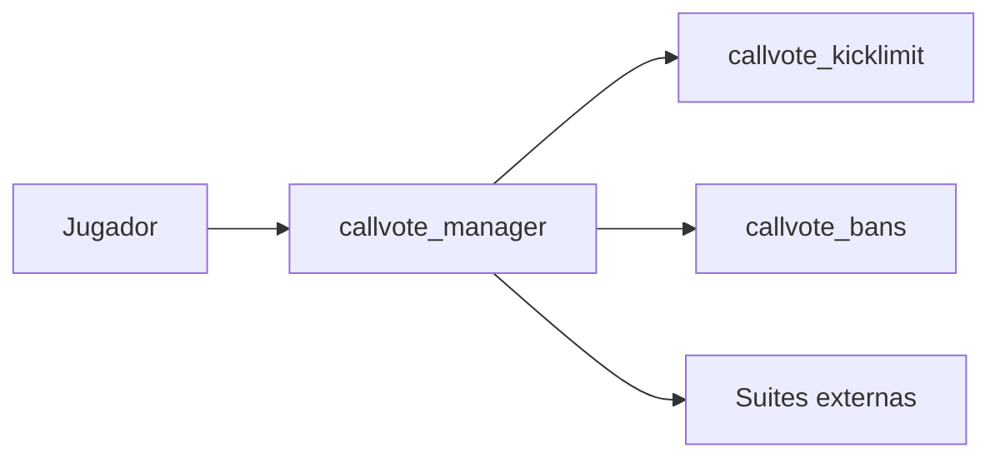

# CallVote Manager Suite

Suite de plugins SourceMod para controlar votaciones en Left 4 Dead 2.

## Vision

La suite se organiza alrededor de un core:

- `callvote_manager`: intercepta y valida votaciones
- `callvote_kicklimit`: aplica politicas de abuso sobre votekick
- `callvote_bans`: componente legado, en salida de esta suite

El objetivo actual del proyecto es consolidar el core como una API estable para extensiones externas.

## Direccion actual

- `AccountID` es la identidad canonica interna
- `SteamID2` se usa solo para presentacion y logs legibles
- MySQL persiste `AccountID` y `SteamID64` para analitica externa
- SQLite se crea automaticamente desde los plugins y no persiste `SteamID64`
- el core expone ciclo de vida de votacion y contexto enriquecido
- las sanciones ya no forman parte del alcance principal de la suite

## Componentes



### [CallVote Manager](docs/README_MANAGER.md)

Core del sistema. Intercepta `callvote`, clasifica el tipo de voto, valida restricciones, construye una sesion de voto y expone forwards y natives para otros plugins.

### [CallVote Kick Limit](docs/README_KICKLIMIT.md)

Extension liviana sobre el core. Usa el contrato publico del manager para limitar la frecuencia de votekicks por jugador.

### [CallVote Bans](docs/README_BANS.md)

Plugin legado de restricciones. El runtime base queda reducido a API, persistencia y validacion; la UX administrativa puede montarse externamente, por ejemplo con `callvote_bans_adminmenu`.

## Documentos tecnicos

- [Implementacion Core AccountID](docs/IMPLEMENTACION_CORE_ACCOUNTID.md)
- [Investigacion HL2SDK y Votaciones](docs/INVESTIGACION_HL2SDK_VOTACIONES.md)
- [Migracion SQL a AccountID](docs/MIGRACION_ACCOUNTID_SQL.md)

## Artefactos

La suite se distribuye mediante artefactos zip publicados por CI y releases de GitHub.

Nombre esperado del paquete:

- `callvote-manager-<version>.zip`

Layout instalable del artefacto:

```text
addons/sourcemod/plugins/callvote/
    callvotemanager.smx
    callvote_kicklimit.smx
    callvote_bans.smx
    callvote_bans_adminmenu.smx

addons/sourcemod/scripting/include/
    callvotemanager.inc
    callvote_stock.inc
    callvote_bans.inc

addons/sourcemod/scripting/
    callvote_manager.sp
    callvote_kicklimit.sp
    callvote_bans.sp
    callvote_bans_adminmenu.sp
    callvote_manager/
    callvote_bans/

addons/sourcemod/configs/
    sql-init-callvote/

addons/sourcemod/translations/
    callvote*.phrases.txt
```

Los binarios publicos de la suite viven en `addons/sourcemod/plugins/callvote/`.

El artefacto no incluye bibliotecas adicionales ajenas a la suite ni requiere limpieza posterior de includes antes de instalarse. El zip ya viene listo para copiar sobre el servidor.

Para integradores como Docker-L4D2-AoC esto significa que el instalador debe consumir el artefacto ya empaquetado y preservar el subdirectorio `callvote` para mantener la suite agrupada.

## Estado

La documentacion principal busca describir arquitectura y contratos. Los detalles operativos finos, comandos y pruebas puntuales quedan fuera del README base.
