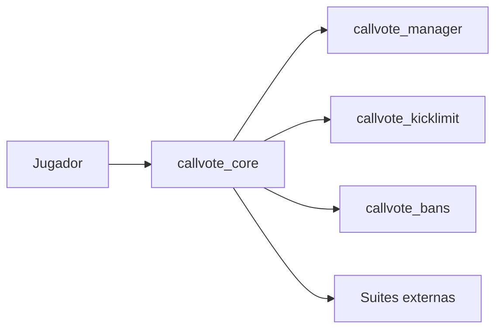

# CallVote Manager Suite

Suite de plugins SourceMod para controlar votaciones en Left 4 Dead 2.

## Vision

La suite se organiza alrededor de un core:

- `callvote_core`: intercepta, crea sesiones y expone el lifecycle
- `callvote_manager`: satelite de politica y UX por defecto
- `callvote_kicklimit`: aplica politicas de abuso sobre votekick
- `callvote_bans`: aplica restricciones de voto y expone API administrativa simple

El objetivo actual del proyecto es consolidar el core como una API estable para extensiones externas.

## Direccion actual

- `AccountID` es la identidad canonica interna
- `SteamID2` se usa solo para presentacion y logs legibles
- MySQL persiste `AccountID` y `SteamID64` para analitica externa
- SQLite se crea automaticamente desde los plugins cuando el entry de `databases.cfg` usa ese motor y mantiene el esquema local minimo
- el core expone ciclo de vida de votacion y contexto enriquecido
- las restricciones de voto se mantienen como componente acotado, no como suite general de sanciones

## Componentes



### [CallVote Manager](docs/README_MANAGER.md)

Plugin satelite de politica y UX por defecto. Consume `CallVote_PreStart` para aplicar inmunidades y reglas base, y luego usa `CallVote_Start` y eventos de progreso para mostrar la experiencia visible del voto.

### [CallVote Kick Limit](docs/README_KICKLIMIT.md)

Extension liviana sobre el core. Usa el contrato publico de `callvote_core` para limitar la frecuencia de votekicks por jugador.

Superficie publica principal:

- comandos `sm_cvkl_show` y `sm_cvkl_count`
- convars `sm_cvkl_*`

### [CallVote Bans](docs/README_BANS.md)

Plugin acotado de restricciones de voto. El runtime base queda reducido a API, persistencia y validacion; la UX administrativa puede montarse externamente, por ejemplo con `callvote_bans_adminmenu`.

Superficie publica principal:

- comandos `sm_cvb_restrict`, `sm_cvb_unrestrict` y `sm_cvb_status`
- paneles `sm_cvb_restrict_panel`, `sm_cvb_unrestrict_panel` y `sm_cvb_status_panel`
- natives `CVB_HasActiveRestriction`, `CVB_GetPlayerRestrictionMask`, `CVB_RestrictPlayer`, `CVB_RemoveRestriction`, `CVB_GetRestrictionInfo`

## Documentos tecnicos

- [Implementacion Core AccountID](docs/IMPLEMENTACION_CORE_ACCOUNTID.md)
- [Investigacion HL2SDK y Votaciones](docs/INVESTIGACION_HL2SDK_VOTACIONES.md)
- [Migracion SQL a AccountID](docs/MIGRACION_ACCOUNTID_SQL.md)

## Artefactos

La suite se distribuye mediante artefactos zip publicados por CI y releases de GitHub.

Nombre esperado del paquete:

- `callvote-manager-<version>.zip`

Layout instalable del artefacto:

```text
addons/sourcemod/plugins/callvote/
    callvote_core.smx
    callvote_manager.smx
    callvote_kicklimit.smx
    callvote_bans.smx
    callvote_bans_adminmenu.smx

addons/sourcemod/scripting/include/
    callvote_core.inc
    callvote_stock.inc
    callvote_bans.inc

addons/sourcemod/scripting/
    callvote_core.sp
    callvote_manager.sp
    callvote_kicklimit.sp
    callvote_bans.sp
    callvote_bans_adminmenu.sp
    callvote_manager/
    callvote_bans/

addons/sourcemod/configs/
    sql-init-callvote/

addons/sourcemod/translations/
    callvote*.phrases.txt
```

Los binarios publicos de la suite viven en `addons/sourcemod/plugins/callvote/`.

El artefacto no incluye bibliotecas adicionales ajenas a la suite ni requiere limpieza posterior de includes antes de instalarse. El zip ya viene listo para copiar sobre el servidor.

Para integradores como Docker-L4D2-AoC esto significa que el instalador debe consumir el artefacto ya empaquetado y preservar el subdirectorio `callvote` para mantener la suite agrupada.

## Estado

La documentacion principal busca describir arquitectura y contratos. Los detalles operativos finos, comandos y pruebas puntuales quedan fuera del README base.
