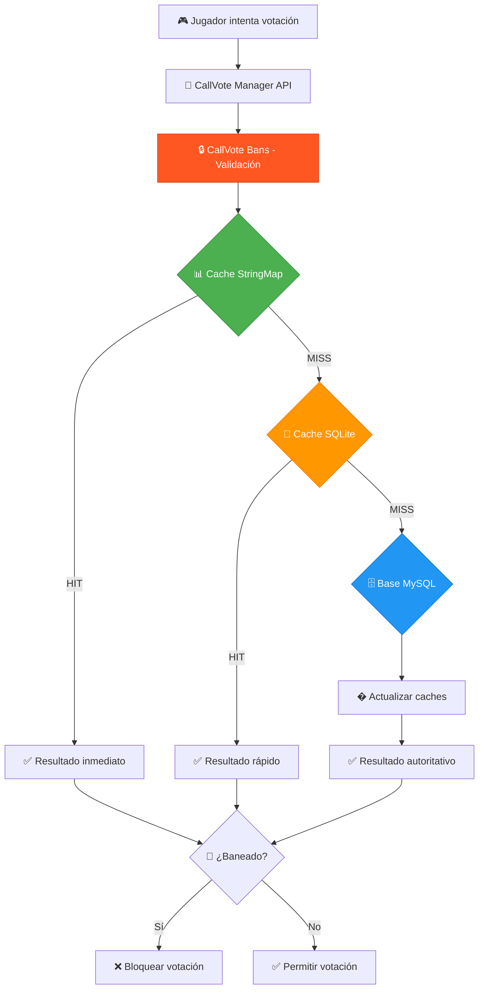

# 🔒 CallVote Bans - Sistema de Restricciones de Votaciones

[](../LICENSE)
[](https://www.sourcemod.net/)
[](https://store.steampowered.com/app/550/Left_4_Dead_2/)

**Sistema avanzado para restringir jugadores de tipos específicos de votaciones con almacenamiento triple y API extendida**

[🏠 Volver al índice principal](../README.md) | [🎯 CallVote Manager](README_MANAGER.md) | [🚫 CallVote Kick Limit](README_KICKLIMIT.md)

---

## 🎯 **¿Qué resuelve CallVote Bans?**

CallVote Bans soluciona el problema de **jugadores problemáticos que abusan del sistema de votaciones**. En lugar de banear completamente a un jugador del servidor, permite **restricciones granulares** que bloquean solo ciertos tipos de votaciones específicas.

### **Problemas que Resuelve**

🚫 **Griefers que spamean votekicks** → Ban solo de votaciones Kick  
🚫 **Jugadores que cambian mapas constantemente** → Ban de ChangeMission/ChangeChapter  
🚫 **Abuso de restart en partidas competitivas** → Ban de RestartGame  
🚫 **Trolls con dificultad** → Ban de ChangeDifficulty  

### **Ventajas sobre Bans Tradicionales**

✅ **Granularidad**: Ban por tipo específico de votación  
✅ **Flexibilidad**: Duraciones desde minutos hasta permanente  
✅ **Integración**: API completa para otros plugins  
✅ **Performance**: Sistema de cache triple optimizado  
✅ **Escalabilidad**: Soporte multi-servidor con sincronización  

---

## 🏗️ **Arquitectura del Sistema**

CallVote Bans utiliza una **arquitectura modular** con separación clara de responsabilidades:



### **Componentes del Sistema**

| Componente | Archivo | Responsabilidad |
|------------|---------|-----------------|
| **🎯 API Core** | `cvb_api.sp` | Natives y forwards centralizados |
| **⚙️ Configuration** | `cvb_reason_config.sp` | Carga de razones desde KeyValues |
| **🗄️ Database Layer** | `cvb_database.sp` | MySQL + SQLite + procedimientos almacenados |
| **📊 Cache Layer** | `cvb_cache.sp` | StringMap en memoria + gestión de estado |
| **🎮 Command Layer** | `cvb_commands.sp` | Comandos admin + validación async |
| **🖥️ UI Layer** | `cvb_menus.sp` | Menús in-game para administradores |
| **📢 Notification** | `cvb_notification.sp` | Sistema unificado de notificaciones |

---

## 💾 **Sistema de Almacenamiento Triple**

CallVote Bans implementa **tres niveles de almacenamiento** optimizados para diferentes escenarios:

### **🚀 Nivel 1: StringMap Cache (Memoria)**
```
⚡ Ultra-rápido (< 1ms)
🎯 Propósito: Consultas frecuentes en tiempo real
🔄 Persistencia: Solo durante sesión del servidor
📊 Contenido: Jugadores activos + consultas recientes
```

**Cuándo se usa:**
- Validación de votaciones en tiempo real
- Jugadores conectados al servidor
- Consultas repetidas del mismo usuario

### **🏃 Nivel 2: SQLite Cache (Disco Local)**
```
⚡ Rápido (< 10ms)
🎯 Propósito: Cache persistente local
🔄 Persistencia: Permanente hasta limpieza
📊 Contenido: Bans frecuentemente consultados
```

**Cuándo se usa:**
- Backup del cache de memoria
- Bans permanentes o de larga duración
- Cuando MySQL no está disponible temporalmente

### **🗄️ Nivel 3: MySQL Database (Autoritativo)**
```
⚡ Estándar (< 50ms)
🎯 Propósito: Fuente de verdad autoritativa
🔄 Persistencia: Permanente y sincronizada
📊 Contenido: Todos los bans del sistema
```

**Cuándo se usa:**
- Fuente de verdad para todos los bans
- Sincronización entre múltiples servidores
- Auditoría y reportes administrativos
- Operaciones de gestión (crear/editar/eliminar bans)

### **🔄 Flujo de Consulta Inteligente**

```sourcepawn
bool IsPlayerBanned(client) {
    // 1. Buscar en StringMap (< 1ms)
    if (StringMapCache.HasData(client))
        return StringMapCache.GetBanStatus(client);
    
    // 2. Buscar en SQLite (< 10ms)
    if (SQLiteCache.HasData(client)) {
        result = SQLiteCache.GetBanStatus(client);
        StringMapCache.Update(client, result);  // Sincronizar hacia arriba
        return result;
    }
    
    // 3. Consultar MySQL (< 50ms)
    result = MySQL.GetBanStatus(client);
    SQLiteCache.Update(client, result);     // Sincronizar hacia SQLite
    StringMapCache.Update(client, result);  // Sincronizar hacia StringMap
    return result;
}
```

---

## ⚙️ **Configuración del Sistema**

### **Configuración de Razones (KeyValues)**

El archivo `configs/callvote_ban_reasons.cfg` utiliza el formato **KeyValues** nativo de Source con estructura numérica:

```keyvalues
"BanReasons"
{
    "ReasonsSize" "11"
    "Reasons"
    {
        "0"
        {
            "code"          "REASON_NONE"
            "keywords"      "none;sin;without"
        }
        
        "1"
        {
            "code"          "REASON_SPAM_VOTES"
            "keywords"      "spam;flood;repetir;repeat"
        }
        
        "2"
        {
            "code"          "REASON_ABUSE_KICK"
            "keywords"      "kick;echar;expulsar"
        }
        
        "5"
        {
            "code"          "REASON_GRIEFING"
            "keywords"      "grief;griefing;trolling;troll;molestar"
        }
        
        "8"
        {
            "code"          "REASON_ADMIN_DECISION"
            "keywords"      "admin;administrative;decision"
        }
        
        "10"
        {
            "code"          "REASON_CUSTOM"
            "keywords"      "custom;personalizada;other;otro"
        }
    }
}
```

**Características del Sistema de Razones:**
- ✅ **11 razones predefinidas** (índices 0-10)
- ✅ **Keywords multiidioma** (inglés/español automático)
- ✅ **Búsqueda inteligente** por keywords
- ✅ **Fallback automático** a `REASON_ADMIN_DECISION`

**Razones Disponibles:**
| Código | Keywords | Uso |
|--------|----------|-----|
| `REASON_SPAM_VOTES` | `spam, flood, repetir` | Spam de votaciones |
| `REASON_ABUSE_KICK` | `kick, echar, expulsar` | Abuso de votekick |
| `REASON_ABUSE_CHANGELEVEL` | `changelevel, map, mapa` | Abuso cambio mapa |
| `REASON_GRIEFING` | `grief, trolling, troll` | Griefing general |
| `REASON_HARASSMENT` | `harass, acoso, abuse` | Acoso/hostigamiento |

### **Configuración de Base de Datos**

#### **MySQL (Recomendado para Producción)**
```ini
# databases.cfg
"callvote_bans"
{
    "driver"        "mysql"
    "host"          "localhost"
    "database"      "l4d2_bans"
    "user"          "callvote_user"
    "pass"          "secure_password"
    "port"          "3306"
    "timeout"       "20"
    "encoding"      "utf8mb4"
}
```

#### **SQLite (Automático - No requiere configuración)**
Se crea automáticamente en `data/callvote_bans_cache.sq3`

### **Configuración de Cache**

```ini
# CallVote Bans Configuration (archivo callvote_bans.cfg)
sm_cvb_enable "1"                    // Habilitar CallVote Bans
sm_cvb_log "0"                       // Logging de actividades (0=off)
sm_cvb_announcer "1"                 // Anunciar bans aplicados
sm_cvb_stringmap_cache "1"           // Habilitar cache StringMap en memoria
```

**Sistema de Razones Inteligente:**
```bash
# Los admins pueden usar cualquier keyword en cualquier idioma:
sm_cvb_ban PlayerName 4 1440 "kick"         # Usa keyword "kick"
sm_cvb_ban PlayerName 4 1440 "echar"        # Usa keyword español "echar"  
sm_cvb_ban PlayerName 8 0 "griefing"        # Usa keyword "griefing"
sm_cvb_ban PlayerName 1 360 "spam"          # Usa keyword "spam"

# El sistema automáticamente convierte a códigos internos:
# "kick" → "#REASON_ABUSE_KICK"
# "griefing" → "#REASON_GRIEFING"
# "spam" → "#REASON_SPAM_VOTES"
```

---

## 🎮 **Operaciones Diarias**

### **Banear Jugadores por Tipo de Votación**

#### **Bans Selectivos con Razones Inteligentes**
```bash
# El sistema acepta keywords en inglés o español automáticamente:

# Ban de votekick por abuso (usa keyword "kick")
sm_cvb_ban PlayerName 4 1440 "kick"
# Tipo 4 = Kick, 1440 minutos = 24 horas

# Ban de cambios de misión (usa keyword "griefing")  
sm_cvb_ban PlayerName 8 0 "griefing"
# Tipo 8 = ChangeMission, 0 = permanente

# Ban múltiple con razón de spam
sm_cvb_ban PlayerName 6 720 "spam" 
# Tipo 6 = 4+2 (Kick+RestartGame), 720 minutos = 12 horas

# Ejemplos con keywords en español:
sm_cvb_ban PlayerName 4 360 "echar"      # keyword español para kick
sm_cvb_ban PlayerName 8 1440 "mapa"      # keyword español para changelevel
sm_cvb_ban PlayerName 1 180 "repetir"    # keyword español para spam
```

#### **Tipos de Ban Disponibles**
```
1   = ChangeDifficulty    (cambio de dificultad)
2   = RestartGame         (reiniciar partida)
4   = Kick                (expulsar jugadores)
8   = ChangeMission       (cambio de campaña)
16  = ReturnToLobby       (volver al lobby)
32  = ChangeChapter       (cambio de capítulo)
64  = ChangeAllTalk       (cambio de alltalk)
127 = ALL                 (todos los tipos)
```

#### **Combinaciones Comunes con Keywords Inteligentes**
```bash
# Griefer completo - usa keyword "griefing"
sm_cvb_ban PlayerName 14 0 "griefing"        # 4+2+8 = 14 (Kick+Restart+Mission)

# Troll de mapas - usa keyword "mapa" (español)
sm_cvb_ban PlayerName 56 2880 "mapa"         # 8+16+32 = 56 (Mission+Lobby+Chapter)

# Spammer - usa keyword "spam"
sm_cvb_ban PlayerName 65 360 "spam"          # 1+64 = 65 (Difficulty+AllTalk)

# Decisión administrativa - usa keyword "admin"
sm_cvb_ban PlayerName 127 1440 "admin"       # 127 = Todos los tipos

# Keywords disponibles más comunes:
# "kick", "echar", "expulsar"          → REASON_ABUSE_KICK
# "spam", "flood", "repetir"           → REASON_SPAM_VOTES  
# "griefing", "grief", "troll"         → REASON_GRIEFING
# "mapa", "map", "changelevel"         → REASON_ABUSE_CHANGELEVEL
# "restart", "reiniciar", "reset"      → REASON_ABUSE_RESTART
# "admin", "administrative"            → REASON_ADMIN_DECISION
```

### **Gestión de Bans Existentes**

#### **Verificar Estado de Ban**
```bash
# Jugador conectado
sm_cvb_check PlayerName

# Jugador offline (por SteamID)
sm_cvb_checkid STEAM_0:1:12345
sm_cvb_checkid [U:1:12345]        # Formato SteamID3
sm_cvb_checkid 76561198012345678  # Formato SteamID64
```

#### **Remover Bans**
```bash
# Jugador conectado
sm_cvb_unban PlayerName

# Jugador offline
sm_cvb_unbanid STEAM_0:1:12345
```

#### **Bans Offline (SteamID) con Keywords**
```bash
# Ban offline por SteamID2 con keyword
sm_cvb_banid STEAM_0:1:12345 4 1440 "kick"

# Ban offline por SteamID3 con keyword español
sm_cvb_banid [U:1:12345] 127 0 "griefing"

# Ban offline por SteamID64 con keyword
sm_cvb_banid 76561198012345678 8 720 "mapa"

# Formatos de SteamID soportados:
# STEAM_0:1:12345      (SteamID2 - formato clásico)
# [U:1:12345]          (SteamID3 - formato moderno)  
# 76561198012345678    (SteamID64 - formato numérico)
```

### **Comandos de Cache y Diagnóstico**

#### **Gestión de Cache StringMap (Memoria)**
```bash
# Verificar cache de jugador conectado
sm_cvb_stringmap_check PlayerName

# Verificar cache offline por SteamID  
sm_cvb_stringmap_checkid STEAM_0:1:12345

# Limpiar cache específico
sm_cvb_stringmap_remove PlayerName
sm_cvb_stringmap_removeid STEAM_0:1:12345

# Estadísticas generales
sm_cvb_stringpool_stats
```

#### **Gestión de Cache SQLite (Disco)**
```bash
# Verificar SQLite local
sm_cvb_sqlite_check PlayerName
sm_cvb_sqlite_checkid STEAM_0:1:12345

# Limpiar cache SQLite
sm_cvb_sqlite_remove PlayerName  
sm_cvb_sqlite_removeid STEAM_0:1:12345
```

#### **Operaciones de Base de Datos MySQL**
```bash
# Instalar/actualizar estructuras (ADMFLAG_ROOT)
sm_cvb_install           # Instalar/actualizar todo el sistema

# Comandos de gestión del cache
sm_cvb_cache_remove PlayerName           # Remover de cache
sm_cvb_cache_remove_offline SteamID      # Remover offline del cache  
sm_cvb_refresh_player PlayerName         # Refrescar datos del jugador
sm_cvb_refresh_player_offline SteamID    # Refrescar datos offline
```

---

## 📚 **Para Desarrolladores**

CallVote Bans proporciona una **API robusta** para integración con otros plugins. La documentación completa está en los archivos include:

### **API Básica**
```sourcepawn
#include <callvote_bans>

// Verificar si un jugador está baneado
bool CVB_IsClientBanned(int client, int voteType);

// Obtener información completa del ban
bool CVB_GetBanInfo(int client, int &banType, int &duration, int &expires, char[] reason);

// Banear jugador desde plugin
bool CVB_BanPlayerByClient(int admin, int target, int banType, int duration, const char[] reason);

// Verificar si los datos están cargados
bool CVB_IsClientLoaded(int client);
```

### **Forwards Disponibles**
```sourcepawn
// Se llama cuando un jugador es baneado
forward void CVB_OnPlayerBanned(int target, int admin, int banType, int duration, const char[] reason);

// Se llama cuando un ban es removido
forward void CVB_OnPlayerUnbanned(int target, int admin);

// Se llama cuando se carga información de ban
forward void CVB_OnBanInfoLoaded(int client, bool isBanned, int banType);
```

**[📖 Ver documentación completa de API →](../addons/sourcemod/scripting/include/callvote_bans.inc)**

---

**[🏠 Volver al índice principal](../README.md) | [🎯 Siguiente: CallVote Manager →](README_MANAGER.md)**

---

*Plugin desarrollado por **lechuga16** - Parte del CallVote Manager Suite*
- **Gestión web** con API robusta y verificación de estado
- **Auto-moderación** con detección de eventos y limpieza automática

---

## 📋 **Descripción General**

CallVote Bans es un **sistema avanzado de restricciones** que permite banear jugadores de tipos específicos de votaciones en Left 4 Dead 2. A diferencia de bans tradicionales del servidor, este sistema **solo restringe la capacidad de iniciar votaciones**, manteniendo al jugador en el servidor.

### **¿Cómo Funciona?**

1. **Interceptación**: Detecta cuando un jugador intenta iniciar una votación
2. **Verificación**: Consulta el sistema de cache multinivel para verificar restricciones
3. **Aplicación**: Bloquea la votación si el jugador tiene un ban activo para ese tipo
4. **Notificación**: Informa al jugador sobre su restricción y al staff sobre la acción

### **Tipos de Restricciones Soportadas**

| Código | Tipo | Descripción |
|--------|------|-------------|
| `1` | Difficulty | Cambiar dificultad |
| `2` | Restart | Reiniciar juego |
| `4` | Kick | Expulsar jugadores |
| `8` | Mission | Cambiar misión |
| `16` | Lobby | Volver al lobby |
| `32` | Chapter | Cambiar capítulo |
| `64` | AllTalk | Cambiar AllTalk |
| `127` | ALL | Todos los tipos |

---

## ✨ **Características**

### ⚡ **Cache Multinivel Reactivo**
- **Nivel 1**: Cache StringMap en memoria (acceso instantáneo)
- **Nivel 2**: Cache SQLite local con TTL configurable (1 semana por defecto)
- **Nivel 3**: Base de datos MySQL con procedimientos almacenados
- **Sistema reactivo**: Solo consulta MySQL cuando el jugador no está en cache
- **Distribución automática**: Cada gameserver construye su cache según necesidad
- **Fallback automático** cuando no hay conectividad MySQL

### 🎭 **Sistema de Bans Flexible**
- **Bans selectivos** por tipo específico de votación
- **Bans temporales** con expiración automática
- **Bans permanentes** para casos severos
- **Combinación de tipos** usando máscaras de bits
- **Soporte universal** para todos los formatos de SteamID

### 📋 **Sistema de Razones Inteligente**
- **10 códigos predefinidos** con auto-detección por palabras clave
- **Configuración externa** en archivo `.cfg` sin recompilación
- **Niveles de severidad** (1-8) con duraciones sugeridas
- **Traducciones completas** multi-idioma
- **Detección automática** de razón por texto libre

### 🔧 **Gestión Administrativa Avanzada**
- **Panel interactivo** con menús para administradores
- **Comandos completos** para gestión offline y online
- **Verificación de integridad** de procedimientos almacenados
- **Estadísticas detalladas** del sistema en tiempo real
- **Limpieza automática** de bans expirados

### 🌐 **API v2.0**
- **12+ natives disponibles** para integración completa
- **Forwards automáticos** para eventos de ban/unban
- **Compatibilidad total** con plugins existentes
- **Verificaciones de estado** para evitar errores de timing

---

## 📥 **Instalación**

### **Archivos Requeridos**
```
addons/sourcemod/plugins/callvote_bans.smx
addons/sourcemod/configs/callvote_ban_reasons.cfg
addons/sourcemod/translations/callvote_bans.phrases.txt
addons/sourcemod/translations/es/callvote_bans.phrases.txt
cfg/sourcemod/callvote_bans.cfg
```

### **Dependencias**
```
Requeridas:
- SourceMod 1.11+
- CallVote Manager (plugin principal)

Opcionales:
- MySQL 5.6+ (recomendado para entornos multi-servidor)
- SQLite 3.0+ (incluido en SourceMod)
```

### **Instalación Paso a Paso**

#### **1. Instalación Básica**
```bash
# Copiar plugin compilado
cp callvote_bans.smx addons/sourcemod/plugins/

# Copiar configuración de razones
cp callvote_ban_reasons.cfg addons/sourcemod/configs/

# Copiar traducciones
cp callvote_bans.phrases.txt addons/sourcemod/translations/
cp es/callvote_bans.phrases.txt addons/sourcemod/translations/es/

# Copiar configuración CVAR
cp callvote_bans.cfg cfg/sourcemod/
```

#### **2. Configuración de Base de Datos**
```ini
# En addons/sourcemod/configs/databases.cfg
"callvote_bans"
{
    "driver"    "mysql"
    "host"      "localhost"
    "database"  "l4d2_callvote"
    "user"      "callvote_user"
    "pass"      "secure_password"
    "timeout"   "20"
    "port"      "3306"
}
```

#### **3. Cargar Plugin y Configurar**
```bash
# Cargar plugin
sm plugins load callvote_bans

# Instalar sistema completo
sm_cvb_install force

# Verificar instalación
sm_cvb_verify

# Ver estado del sistema
sm_cvb_stats
```

#### **4. Verificación de Funcionamiento**
```bash
# Probar comando básico
sm_cvb_check

# Ver configuración actual
sm_cvar_list | grep cvb

# Verificar cache
sm_cvb_cache_clear
```

---

## ⚙️ **Configuración**

### **CVARs Principales**

#### **Control General**
```ini
# Activación del sistema
sm_cvb_enable "1"                    // Activar CallVote Bans (0=off, 1=on)
```

#### **Configuración de Cache Reactivo**
```ini
# Control del sistema reactivo
sm_cvb_cache_sqlite "1"              # Activar cache SQLite local (0=off, 1=on)
sm_cvb_sqlite_ttl_minutes "10080"    # TTL del cache en minutos (1 semana por defecto)
                                     # Valores recomendados:
                                     # - 10080 (1 semana): Servidor estándar
                                     # - 1440 (24 horas): Multi-servidor dinámico
                                     # - 30 (30 minutos): Alto tráfico/testing
```

#### **Sistema Maestro-Esclavo** ⭐ **NUEVO v2.0**
```ini
# Control del sistema de limpieza automática
sm_cvb_sqlite_master "0"             # Configurar como maestro (1) o esclavo (0)
                                     # Solo UN servidor debe ser maestro en el entorno
sm_cvb_sqlite_force_cleanup_hour "-1" # Hora diaria para limpieza forzada (0-23, -1=deshabilitado)
                                       # Recomendado: "3" para limpieza a las 3:00 AM
sm_cvb_sqlite_cleanup_threshold "-1"   # Limpiar cuando se alcance este número de registros (-1=deshabilitado)
                                       # Recomendado: "50000" para entornos de alto tráfico
```

#### **Anuncios y Notificaciones**
```ini
# Sistema de anuncios
sm_cvb_announce_join "1"             // Anunciar jugadores baneados al conectar
                                     // 0=off, 1=solo admins, 2=todos
```

### **Configuración de Razones**

#### **Archivo: callvote_ban_reasons.cfg**
```ini
// Configuración de razones para CallVote Bans
// Formato: "código" "nombre" "palabras_clave" "severidad" "duración_sugerida"

"1" "Spam de Votaciones" "spam,repetir,flood,molesto" "3" "60"
"2" "Trolling" "troll,molestar,griefing" "5" "120" 
"3" "Uso Indebido" "abuse,mal uso,inadecuado" "4" "90"
"4" "Comportamiento Tóxico" "toxico,hostil,agresivo" "6" "240"
"5" "Griefing" "griefing,sabotage,sabotear" "7" "360"
"6" "Acoso" "acoso,harassment,hostigar" "8" "480"
"7" "Disruption" "interrumpir,disturb,molestar" "4" "120"
"8" "Abuso Repetido" "repetido,constante,persistente" "6" "720"
"9" "Evasión de Ban" "evasion,evade,burlar" "8" "1440"
"10" "Otros" "otros,general,varios" "2" "30"
```

#### **Estructura de Razones**
- **Código**: Número único (1-10)
- **Nombre**: Descripción corta de la razón
- **Palabras Clave**: Lista separada por comas para auto-detección
- **Severidad**: Nivel 1-8 (1=leve, 8=severo)
- **Duración Sugerida**: Minutos recomendados para esta razón

### **Configuración Avanzada**

#### **Configuración para Cache Reactivo**
```ini
# Para servidor individual con usuarios regulares
sm_cvb_cache_sqlite "1"              # Cache local activado
sm_cvb_sqlite_ttl_minutes "10080"    # TTL 1 semana (máximo aprovechamiento)

# Para entorno multi-servidor con usuarios dinámicos
sm_cvb_cache_sqlite "1"              # Cache local activado
sm_cvb_sqlite_ttl_minutes "1440"     # TTL 24 horas (balance rendimiento/actualización)

# Para desarrollo y testing
sm_cvb_cache_sqlite "1"              # Cache local activado
sm_cvb_sqlite_ttl_minutes "30"       # TTL 30 minutos (máxima actualización)
```

#### **Entornos Multi-Servidor con Cache Reactivo**
```ini
# Configuración para 8 gameservers por máquina física
sm_cvb_cache_sqlite "1"              # Cache local activado (compartido por 8 gameservers)
sm_cvb_sqlite_ttl_minutes "2880"     # TTL 48 horas (balance entre máquinas)

# En databases.cfg usar servidor MySQL central (compartido entre máquinas)
"callvote_bans"
{
    "driver"    "mysql"
    "host"      "central.mysql.server"    # Servidor central para las 3 máquinas físicas
    "database"  "shared_callvote"
    // ... resto de configuración
}
```

### **Arquitectura Multi-Servidor Real**

```
┌─────────────────────────────────────────────┐  ┌─────────────────────────────────────────────┐  ┌─────────────────────────────────────────────┐
│                MÁQUINA FÍSICA 1             │  │                MÁQUINA FÍSICA 2             │  │                MÁQUINA FÍSICA 3             │
│                                             │  │                                             │  │                                             │
│ ┌──────┐ ┌──────┐ ┌──────┐ ┌──────┐        │  │ ┌──────┐ ┌──────┐ ┌──────┐ ┌──────┐        │  │ ┌──────┐ ┌──────┐ ┌──────┐ ┌──────┐        │
│ │Game  │ │Game  │ │Game  │ │Game  │        │  │ │Game  │ │Game  │ │Game  │ │Game  │        │  │ │Game  │ │Game  │ │Game  │ │Game  │        │
│ │Srv 1 │ │Srv 2 │ │Srv 3 │ │Srv 4 │        │  │ │Srv 9 │ │Srv10 │ │Srv11 │ │Srv12 │        │  │ │Srv17 │ │Srv18 │ │Srv19 │ │Srv20 │        │
│ │      │ │      │ │      │ │      │        │  │ │      │ │      │ │      │ │      │        │  │ │      │ │      │ │      │ │      │        │
│ │ SM   │ │ SM   │ │ SM   │ │ SM   │        │  │ │ SM   │ │ SM   │ │ SM   │ │ SM   │        │  │ │ SM   │ │ SM   │ │ SM   │ │ SM   │        │
│ │Cache │ │Cache │ │Cache │ │Cache │        │  │ │Cache │ │Cache │ │Cache │ │Cache │        │  │ │Cache │ │Cache │ │Cache │ │Cache │        │
│ └──┬───┘ └──┬───┘ └──┬───┘ └──┬───┘        │  │ └──┬───┘ └──┬───┘ └──┬───┘ └──┬───┘        │  │ └──┬───┘ └──┬───┘ └──┬───┘ └──┬───┘        │
│    │        │        │        │            │  │    │        │        │        │            │  │    │        │        │        │            │
│ ┌──────┐ ┌──────┐ ┌──────┐ ┌──────┐        │  │ ┌──────┐ ┌──────┐ ┌──────┐ ┌──────┐        │  │ ┌──────┐ ┌──────┐ ┌──────┐ ┌──────┐        │
│ │Game  │ │Game  │ │Game  │ │Game  │        │  │ │Game  │ │Game  │ │Game  │ │Game  │        │  │ │Game  │ │Game  │ │Game  │ │Game  │        │
│ │Srv 5 │ │Srv 6 │ │Srv 7 │ │Srv 8 │        │  │ │Srv13 │ │Srv14 │ │Srv15 │ │Srv16 │        │  │ │Srv21 │ │Srv22 │ │Srv23 │ │Srv24 │        │
│ │      │ │      │ │      │ │      │        │  │ │      │ │      │ │      │ │      │        │  │ │      │ │      │ │      │ │      │        │
│ │ SM   │ │ SM   │ │ SM   │ │ SM   │        │  │ │ SM   │ │ SM   │ │ SM   │ │ SM   │        │  │ │ SM   │ │ SM   │ │ SM   │ │ SM   │        │
│ │Cache │ │Cache │ │Cache │ │Cache │        │  │ │Cache │ │Cache │ │Cache │ │Cache │        │  │ │Cache │ │Cache │ │Cache │ │Cache │        │
│ └──┬───┘ └──┬───┘ └──┬───┘ └──┬───┘        │  │ └──┬───┘ └──┬───┘ └──┬───┘ └──┬───┘        │  │ └──┬───┘ └──┬───┘ └──┬───┘ └──┬───┘        │
│    │        │        │        │            │  │    │        │        │        │            │  │    │        │        │        │            │
│    └────────┼────────┼────────┘            │  │    └────────┼────────┼────────┘            │  │    └────────┼────────┼────────┘            │
│             │        │                     │  │             │        │                     │  │             │        │                     │
│        ┌────┴────────┴────┐                │  │        ┌────┴────────┴────┐                │  │        ┌────┴────────┴────┐                │
│        │   SQLite Local   │                │  │        │   SQLite Local   │                │  │        │   SQLite Local   │                │
│        │ (Compartido por  │                │  │        │ (Compartido por  │                │  │        │ (Compartido por  │                │
│        │ 8 GameServers)   │                │  │        │ 8 GameServers)   │                │  │        │ 8 GameServers)   │                │
│        └─────────┬────────┘                │  │        └─────────┬────────┘                │  │        └─────────┬────────┘                │
└──────────────────┼─────────────────────────┘  └──────────────────┼─────────────────────────┘  └──────────────────┼─────────────────────────┘
                   │                                               │                                               │
                   │                                               │                                               │
                   └───────────────────────────────────────────────┼───────────────────────────────────────────────┘
                                                                   │
                                                                   ▼
                                              ┌─────────────────────────────┐
                                              │       MySQL Central         │
                                              │    (Shared Database)        │
                                              │                             │
                                              │ • Procedimientos almacenados│
                                              │ • Datos centrales           │
                                              │ • Backup/Historia          │
                                              │ • Sincronización global    │
                                              └─────────────────────────────┘
```

**Arquitectura Real:**
- **24 GameServers** distribuidos en 3 máquinas físicas (8 servidores por máquina)
- **3 bases SQLite** (una por máquina física, compartida por 8 gameservers)
- **1 MySQL Central** compartido por todas las máquinas
- **Cache StringMap** individual por cada gameserver (24 caches independientes)

**Ventajas de esta arquitectura:**
- **Eficiencia local**: 8 gameservers comparten SQLite sin conflictos
- **Distribución equilibrada**: Cada máquina maneja su propia carga
- **Sincronización global**: MySQL mantiene consistencia entre máquinas
- **Tolerancia a fallos**: Si MySQL falla, cada máquina opera independientemente

---

## 🔄 **Sistema de Cache Reactivo**

### **Filosofía del Sistema**
CallVote Bans implementa un **sistema de cache reactivo** que consulta información solo cuando es necesaria, optimizando el rendimiento de red y distribuyendo la carga de manera eficiente.

### **Flujo de Operación**

```
┌─────────────────┐
│   Jugador       │
│   Conecta a     │
│   GameServer X  │
└─────────┬───────┘
          │
          ▼
┌─────────────────┐    ❌ No encontrado
│  Cache Memory   │───────────┐
│  (StringMap)    │           │
│ GameServer X    │           │
└─────────────────┘           │
          │                   │
          │ ✅ Encontrado      │
          │                   ▼
┌─────────────────┐    ❌ No encontrado
│  Respuesta      │    │  Cache SQLite   │
│  Inmediata      │    │ (Máquina Física)│
└─────────────────┘    │ Compartido por  │
                       │ 8 GameServers   │
                       └─────────┬───────┘
                                │
                                │ ✅ Encontrado
                                ▼
                       ┌─────────────────┐
                       │  Respuesta      │
                       │  Rápida         │
                       │ (Local a la     │
                       │  máquina)       │
                       └─────────────────┘
                                │
                                │ ❌ No encontrado
                                ▼
                       ┌─────────────────┐
                       │  Consulta       │
                       │  MySQL Central  │
                       │ (Entre máquinas)│
                       └─────────┬───────┘
                                │
                                ▼
                       ┌─────────────────┐
                       │  Guarda en      │
                       │  SQLite Local   │
                       │ (TTL: 1 semana) │
                       │ Disponible para │
                       │ todos los 8     │
                       │ GameServers     │
                       └─────────┬───────┘
                                │
                                ▼
                       ┌─────────────────┐
                       │  Guarda en      │
                       │  StringMap      │
                       │ (Solo este      │
                       │  GameServer)    │
                       └─────────┬───────┘
                                │
                                ▼
                       ┌─────────────────┐
                       │  Respuesta      │
                       │  Final          │
                       └─────────────────┘
```

### **Ventajas del Sistema Reactivo**

#### **🚀 Rendimiento Optimizado**
- **Solo consulta cuando es necesario**: No hay sincronización masiva innecesaria
- **Carga distribuida**: Cada gameserver maneja solo sus usuarios activos
- **Escalabilidad natural**: Más servidores = menos carga por servidor

#### **💾 Uso Eficiente de Recursos**
- **Cache inteligente**: Solo guarda información de usuarios que se conectan
- **TTL configurable**: Evita que el cache crezca indefinidamente
- **Memoria optimizada**: StringMap solo para sesiones activas

#### **🌐 Ideal para Multi-Servidor y Multi-Máquina**
- **Sin competencia por recursos**: Cada gameserver opera independientemente en memoria
- **SQLite compartido local**: Los gameservers por máquina comparten eficientemente el cache
- **Tolerancia a fallos**: Si MySQL falla, cada máquina mantiene sus servidores funcionando
- **Distribución automática**: Los usuarios más activos se cachean naturalmente en cada máquina
- **Escalabilidad horizontal**: Agregar máquinas físicas no impacta el rendimiento

### **Configuración del Sistema Reactivo**

#### **Para Servidor Individual**
```ini
# Configuración estándar - rendimiento óptimo
sm_cvb_cache_sqlite "1"              # Cache local activado
sm_cvb_sqlite_ttl_minutes "10080"    # TTL 1 semana (recomendado)
```

#### **Para Múltiples GameServers en Máquinas Físicas**
```ini
# Configuración para 8 gameservers por máquina física
sm_cvb_cache_sqlite "1"              # Cache local activado
sm_cvb_sqlite_ttl_minutes "1440"     # TTL 24 horas (compartido entre 8 servidores)
```

#### **Para Entorno Multi-Máquina (24+ GameServers)**
```ini
# Configuración optimizada para múltiples máquinas físicas
sm_cvb_cache_sqlite "1"              # Cache local activado
sm_cvb_sqlite_ttl_minutes "2880"     # TTL 48 horas (mayor persistencia entre máquinas)
```

#### **Para Alto Tráfico**
```ini
# Configuración para servidores de alto tráfico
sm_cvb_cache_sqlite "1"              # Cache local activado
sm_cvb_sqlite_ttl_minutes "30"       # TTL 30 minutos (muy dinámico)
```

### **Métricas de Rendimiento**

| Escenario | Consultas MySQL | Cache Hit Rate | Latencia Promedio |
|-----------|-----------------|----------------|-------------------|
| **Máquina Nueva** | 100% primera vez por gameserver | 0% inicial → 95% después | 50ms → 1ms |
| **Máquina Establecida** | <2% total (8 gameservers) | >98% usuarios regulares | <1ms promedio |
| **8 GameServers Simultáneos** | 5-10% nuevos usuarios | 90-95% usuarios conocidos | <2ms promedio |
| **Picos de Tráfico Multi-Máquina** | 15-25% entre máquinas | 75-85% cache compartido | <5ms promedio |

### **Casos de Uso Típicos**

#### **GameServer Individual en Máquina Compartida**
```
1. Primera conexión: StringMap (❌) → SQLite Compartido (❌) → MySQL (✅) → Cache local por 24-48h
2. Siguientes conexiones en el mismo GameServer: StringMap (✅) → Respuesta inmediata
3. Conexiones en otros GameServers de la misma máquina: SQLite Compartido (✅) → Respuesta rápida
```

#### **Jugador Migrando Entre Máquinas**
```
1. Conecta a GameServer en Máquina 1: Cache local disponible
2. Conecta a GameServer en Máquina 2: SQLite local (❌) → MySQL (✅) → Cache por TTL
3. Conecta a otro GameServer en Máquina 2: SQLite local (✅) → Respuesta rápida
```

#### **Jugador Baneado en Ambiente Multi-Máquina**
```
1. Ban aplicado desde cualquier GameServer → Inmediatamente en MySQL
2. Información se distribuye reactivamente cuando el jugador se conecta a otras máquinas
3. SQLite local se actualiza en cada máquina según necesidad
4. Auto-limpieza cuando expira el ban (sincronizada por MySQL)
```

---

## 🎮 **Comandos**

### **Comandos de Administración**

#### **Gestión de Bans**
| Comando | Nivel | Descripción |
|---------|-------|-------------|
| `sm_cvb_ban` | ADMFLAG_BAN | Panel interactivo para banear jugadores online |
| `sm_cvb_unban` | ADMFLAG_BAN | Panel interactivo para desbanear jugadores |
| `sm_cvb_ban_offline` | ADMFLAG_BAN | Ban por SteamID para jugadores offline |
| `sm_cvb_check` | ADMFLAG_GENERIC | Ver estado detallado de ban de un jugador |

#### **Administración del Sistema**
| Comando | Nivel | Descripción |
|---------|-------|-------------|
| `sm_cvb_install` | ADMFLAG_ROOT | Instalar sistema completo con procedimientos |
| `sm_cvb_verify` | ADMFLAG_ROOT | Verificar integridad de procedimientos almacenados |
| `sm_cvb_stats` | ADMFLAG_BAN | Estadísticas generales del sistema |

#### **Gestión de Cache**
| Comando | Nivel | Descripción |
|---------|-------|-------------|
| `sm_cvb_cache_clear` | ADMFLAG_BAN | Limpiar cache del sistema |
| `sm_cvb_sqlite_stats` | ADMFLAG_BAN | Estadísticas del cache SQLite |
| `sm_cvb_sqlite_vacuum` | ADMFLAG_BAN | Optimizar base de datos SQLite |
| `sm_cvb_sqlite_check` | ADMFLAG_BAN | Verificar registros por AccountID en cache SQLite |
| `sm_cvb_sqlite_checkid` | ADMFLAG_BAN | Verificar registro específico por ID en cache |

#### **Mantenimiento**
| Comando | Nivel | Descripción |
|---------|-------|-------------|
| `sm_cvb_cleanup` | ADMFLAG_BAN | Limpieza manual de bans expirados |

### **Comandos de Usuario**
| Comando | Descripción |
|---------|-------------|
| `sm_mybans` | Ver mi estado personal de restricciones |

### **Ejemplos de Uso**

#### **Bans Interactivos**
```bash
# Abrir panel para banear jugador online
sm_cvb_ban

# Abrir panel para desbanear
sm_cvb_unban

# Ver estado de un jugador específico
sm_cvb_check "PlayerName"
```

#### **Bans por SteamID**
```bash
# Ban básico - 60 minutos de todos los tipos por spam
sm_cvb_ban_offline STEAM_0:1:12345 127 60 "Spam de votaciones repetidas"

# Ban específico - solo kick por 2 horas
sm_cvb_ban_offline [U:1:24691] 4 120 "Abuse de kick votes"

# Ban permanente para trolling severo
sm_cvb_ban_offline 76561198000000000 127 0 "Griefing persistente"

# Ban de misiones por 30 minutos
sm_cvb_ban_offline 12345 8 30 "Cambio constante de misiones"
```

#### **Verificación y Diagnóstico**
```bash
# Ver estado general del sistema
sm_cvb_stats

# Verificar integridad
sm_cvb_verify

# Limpiar cache y recargar
sm_cvb_cache_clear

# Ver estadísticas de SQLite
sm_cvb_sqlite_stats

# Optimizar base de datos local
sm_cvb_sqlite_vacuum

# Verificar registros específicos en cache SQLite
sm_cvb_sqlite_check 123456789

# Verificar registro por ID interno
sm_cvb_sqlite_checkid 42
```

#### **Mantenimiento Programado**
```bash
# Limpiar bans expirados manualmente
sm_cvb_cleanup

# Reinstalar sistema completo
sm_cvb_install force

# Ver mi estado como usuario
sm_mybans
```

---

## 🔗 **API para Desarrolladores**

### **Natives Disponibles v2.0**

#### **Verificación de Estado**
```sourcepawn
/**
 * Verifica si un jugador está baneado para un tipo específico de votación
 *
 * @param client    Índice del cliente (1-MaxClients)
 * @param voteType  Tipo de votación a verificar
 * @return          true si está baneado, false si no
 */
native bool CVB_IsPlayerBanned(int client, int voteType);

/**
 * Obtiene la máscara de bits con todos los tipos de ban activos
 *
 * @param client    Índice del cliente (1-MaxClients)
 * @return          Máscara de bits con tipos de ban (0 = sin bans)
 */
native int CVB_GetPlayerBanType(int client);

/**
 * Obtiene el timestamp de expiración del ban
 *
 * @param client    Índice del cliente (1-MaxClients)  
 * @return          Timestamp de expiración (0 = permanente, -1 = sin ban)
 */
native int CVB_GetPlayerBanExpiration(int client);

/**
 * Verifica si la información del cliente está completamente cargada
 * NUEVO v2.0 - Usar antes de otros natives para evitar errores de timing
 *
 * @param client    Índice del cliente (1-MaxClients)
 * @return          true si está cargado, false si aún se está cargando
 */
native bool CVB_IsClientLoaded(int client);
```

#### **Información Completa**
```sourcepawn
/**
 * Obtiene toda la información de ban de una sola llamada
 * NUEVO v2.0 - Más eficiente que múltiples consultas
 *
 * @param client        Índice del cliente (1-MaxClients)
 * @param banType       Variable para almacenar tipo de ban
 * @param expiration    Variable para almacenar timestamp de expiración
 * @param createdTime   Variable para almacenar timestamp de creación
 * @param reason        Buffer para almacenar razón del ban
 * @param reasonMaxLen  Tamaño máximo del buffer de razón
 * @param adminSteamId  Buffer para almacenar SteamID del admin
 * @param adminMaxLen   Tamaño máximo del buffer de admin
 * @return              true si tiene ban activo, false si no
 */
native bool CVB_GetBanInfo(int client, int &banType, int &expiration, int &createdTime, 
                          char[] reason, int reasonMaxLen, char[] adminSteamId, int adminMaxLen);
```

#### **Gestión de Bans**
```sourcepawn
/**
 * Banea un jugador usando AccountIDs y SteamIDs
 *
 * @param targetAccountId   AccountID del jugador objetivo
 * @param targetSteamId2    SteamID2 del jugador objetivo
 * @param banType           Tipos de votación a banear (máscara de bits)
 * @param durationMinutes   Duración en minutos (0 = permanente)
 * @param adminAccountId    AccountID del administrador
 * @param adminSteamId2     SteamID2 del administrador
 * @param reason            Razón del ban
 * @return                  true si se procesó correctamente
 */
native bool CVB_BanPlayer(int targetAccountId, const char[] targetSteamId2, 
                         int banType, int durationMinutes, int adminAccountId, 
                         const char[] adminSteamId2, const char[] reason);

/**
 * Remueve el ban de un jugador
 *
 * @param targetAccountId   AccountID del jugador objetivo
 * @param targetSteamId2    SteamID2 del jugador objetivo  
 * @param adminAccountId    AccountID del administrador
 * @param adminSteamId2     SteamID2 del administrador
 * @return                  true si se procesó correctamente
 */
native bool CVB_UnbanPlayer(int targetAccountId, const char[] targetSteamId2, 
                           int adminAccountId, const char[] adminSteamId2);

/**
 * Versión simplificada para banear usando índices de cliente directamente
 * NUEVO v2.0 - Más fácil de usar para la mayoría de casos
 *
 * @param targetClient      Índice del cliente objetivo (1-MaxClients)
 * @param banType           Tipos de votación a banear (máscara de bits)
 * @param durationMinutes   Duración en minutos (0 = permanente)
 * @param adminClient       Índice del cliente administrador (1-MaxClients)
 * @param reason            Razón del ban
 * @return                  true si se procesó correctamente
 */
native bool CVB_BanPlayerByClient(int targetClient, int banType, int durationMinutes, 
                                 int adminClient, const char[] reason);
```

#### **Gestión de Cache**
```sourcepawn
/**
 * Limpia el cache del sistema
 * NUEVO v2.0 - Para forzar recarga de información
 *
 * @param accountId     AccountID específico a limpiar (0 = limpiar todo)
 * @return              true si se ejecutó correctamente
 */
native bool CVB_ClearCache(int accountId = 0);
```

#### **Sistema de Razones**
```sourcepawn
/**
 * Obtiene la razón de ban traducida para el cliente
 *
 * @param reasonCode    Código de razón (1-10)
 * @param client        Cliente para traducción
 * @param buffer        Buffer para almacenar texto
 * @param maxlen        Tamaño máximo del buffer
 * @return              true si se encontró la razón
 */
native bool CVB_GetBanReasonString(int reasonCode, int client, char[] buffer, int maxlen);

/**
 * Convierte texto de razón a código numérico por palabras clave
 *
 * @param reasonText    Texto de razón a analizar
 * @return              Código de razón detectado (0 = no detectado)
 */
native int CVB_GetReasonIdFromText(const char[] reasonText);

/**
 * Verifica si un código de razón es válido
 *
 * @param code          Código a verificar
 * @return              true si es válido
 */
native bool CVB_IsValidReasonCode(int code);
```

### **Forwards Disponibles v2.0**

#### **Eventos de Votaciones**
```sourcepawn
/**
 * Se llama cuando una votación es bloqueada por el sistema
 *
 * @param client    Cliente que intentó la votación
 * @param voteType  Tipo de votación bloqueada
 * @param target    Cliente objetivo (solo para kick)
 * @param banType   Tipo de ban que causó el bloqueo
 */
forward void CVB_OnVoteBlocked(int client, int voteType, int target, int banType);
```

#### **Eventos de Bans** ⭐ **NUEVOS v2.0**
```sourcepawn
/**
 * Se llama cuando un jugador es baneado
 * NUEVO v2.0 - Para sistemas de notificaciones automáticas
 *
 * @param targetAccountId   AccountID del jugador baneado
 * @param targetSteamId2    SteamID2 del jugador baneado
 * @param banType           Tipos de votación baneados
 * @param durationMinutes   Duración del ban en minutos
 * @param adminAccountId    AccountID del administrador
 * @param adminSteamId2     SteamID2 del administrador
 * @param reason            Razón del ban
 */
forward void CVB_OnPlayerBanned(int targetAccountId, const char[] targetSteamId2, int banType, 
                               int durationMinutes, int adminAccountId, const char[] adminSteamId2, 
                               const char[] reason);

/**
 * Se llama cuando un jugador es desbaneado
 * NUEVO v2.0 - Para sistemas de notificaciones automáticas
 *
 * @param targetAccountId   AccountID del jugador desbaneado
 * @param targetSteamId2    SteamID2 del jugador desbaneado
 * @param adminAccountId    AccountID del administrador
 * @param adminSteamId2     SteamID2 del administrador
 */
forward void CVB_OnPlayerUnbanned(int targetAccountId, const char[] targetSteamId2, 
                                 int adminAccountId, const char[] adminSteamId2);
```

#### **Sistema de Configuración**
```sourcepawn
/**
 * Se llama cuando se cargan las razones desde el archivo de configuración
 *
 * @param reasonCount   Número de razones cargadas exitosamente
 */
forward void CVB_OnBanReasonsLoaded(int reasonCount);
```

### **Ejemplos de Integración**

#### **Ejemplo 1: Sistema de Notificaciones Discord**
```sourcepawn
#include <callvote_bans>
#include <discord>

public void CVB_OnPlayerBanned(int targetAccountId, const char[] targetSteamId2, int banType, 
                               int durationMinutes, int adminAccountId, const char[] adminSteamId2, 
                               const char[] reason)
{
    char message[512];
    char durationStr[64];
    
    if (durationMinutes == 0)
        strcopy(durationStr, sizeof(durationStr), "Permanente");
    else
        Format(durationStr, sizeof(durationStr), "%d minutos", durationMinutes);
    
    Format(message, sizeof(message), 
           "🚫 **CallVote Ban**\\n**Jugador:** %s\\n**Duración:** %s\\n**Razón:** %s\\n**Admin:** %s",
           targetSteamId2, durationStr, reason, adminSteamId2);
    
    Discord_SendMessage("callvote-bans", message);
}

public void CVB_OnPlayerUnbanned(int targetAccountId, const char[] targetSteamId2, 
                                 int adminAccountId, const char[] adminSteamId2)
{
    char message[256];
    Format(message, sizeof(message), 
           "✅ **CallVote Unban**\\n**Jugador:** %s\\n**Admin:** %s",
           targetSteamId2, adminSteamId2);
    
    Discord_SendMessage("callvote-bans", message);
}
```

#### **Ejemplo 2: Verificación Robusta con Estado de Carga**
```sourcepawn
#include <callvote_bans>

public Action OnPlayerCommand(int client, const char[] command, int argc)
{
    if (StrEqual(command, "callvote"))
    {
        // PASO 1: Verificar si la información está cargada (NUEVO v2.0)
        if (!CVB_IsClientLoaded(client))
        {
            PrintToChat(client, "⏳ Cargando información, espera un momento...");
            return Plugin_Handled;
        }
        
        // PASO 2: Verificar ban específico según el tipo de voto
        char voteArg[32];
        GetCmdArg(1, voteArg, sizeof(voteArg));
        
        int voteType = 0;
        if (StrEqual(voteArg, "kick"))
            voteType = 4;
        else if (StrEqual(voteArg, "changedifficulty"))
            voteType = 1;
        else if (StrEqual(voteArg, "restartgame"))
            voteType = 2;
        // ... otros tipos
        
        if (voteType > 0 && CVB_IsPlayerBanned(client, voteType))
        {
            PrintToChat(client, "❌ No puedes iniciar este tipo de votación");
            return Plugin_Handled;
        }
    }
    return Plugin_Continue;
}
```

#### **Ejemplo 3: Información Completa de Ban**
```sourcepawn
#include <callvote_bans>

public Action Command_DetailedBanCheck(int client, int args)
{
    int target = client;
    
    // Si se especifica un objetivo
    if (args > 0)
    {
        char targetName[64];
        GetCmdArg(1, targetName, sizeof(targetName));
        target = FindTarget(client, targetName, true);
        if (target == NO_INDEX) return Plugin_Handled;
    }
    
    // Verificar estado de carga primero
    if (!CVB_IsClientLoaded(target))
    {
        ReplyToCommand(client, "Información aún cargándose para ese jugador");
        return Plugin_Handled;
    }
    
    // Obtener información completa (NUEVO v2.0)
    int banType, expiration, createdTime;
    char reason[256], adminSteamId[32];
    
    if (CVB_GetBanInfo(target, banType, expiration, createdTime, reason, sizeof(reason), 
                       adminSteamId, sizeof(adminSteamId)))
    {
        char targetName[64];
        GetClientName(target, targetName, sizeof(targetName));
        
        ReplyToCommand(client, "=== Ban Info: %s ===", targetName);
        ReplyToCommand(client, "Tipos baneados: %d", banType);
        
        if (expiration == 0)
            ReplyToCommand(client, "Duración: Permanente");
        else
        {
            char timeStr[64];
            FormatTime(timeStr, sizeof(timeStr), "%Y-%m-%d %H:%M", expiration);
            ReplyToCommand(client, "Expira: %s", timeStr);
        }
        
        ReplyToCommand(client, "Razón: %s", reason);
        ReplyToCommand(client, "Admin: %s", adminSteamId);
    }
    else
    {
        char targetName[64];
        GetClientName(target, targetName, sizeof(targetName));
        ReplyToCommand(client, "%s no tiene restricciones activas", targetName);
    }
    
    return Plugin_Handled;
}
```

#### **Ejemplo 4: Sistema de Estadísticas Automático**
```sourcepawn
#include <callvote_bans>

int g_DailyBans = 0;
int g_WeeklyBans = 0;

public void CVB_OnPlayerBanned(int targetAccountId, const char[] targetSteamId2, int banType, 
                               int durationMinutes, int adminAccountId, const char[] adminSteamId2, 
                               const char[] reason)
{
    g_DailyBans++;
    g_WeeklyBans++;
    
    // Log detallado para análisis
    LogToFile("logs/callvote_bans_stats.log", 
              "[BAN] %s banned by %s | Type: %d | Duration: %d min | Reason: %s",
              targetSteamId2, adminSteamId2, banType, durationMinutes, reason);
    
    // Alertar si hay actividad inusual
    if (g_DailyBans > 20)
    {
        LogMessage("WARNING: High ban activity detected (%d bans today)", g_DailyBans);
        
        // Notificar a admins online
        for (int i = 1; i <= MaxClients; i++)
        {
            if (IsClientInGame(i) && CheckCommandAccess(i, "sm_admin", ADMFLAG_GENERIC))
            {
                PrintToChat(i, "[ALERT] Alta actividad de bans: %d hoy", g_DailyBans);
            }
        }
    }
}

// Timer para resetear estadísticas diarias
public Action Timer_ResetDailyStats(Handle timer)
{
    LogMessage("Daily stats reset: %d bans today", g_DailyBans);
    g_DailyBans = 0;
    return Plugin_Continue;
}
```

#### **Ejemplo 5: Plugin de Auto-moderación**
```sourcepawn
#include <callvote_bans>

public void CVB_OnVoteBlocked(int client, int voteType, int target, int banType)
{
    static int g_BlockCount[MAXPLAYERS + 1];
    
    g_BlockCount[client]++;
    
    // Si un jugador intenta votar repetidamente mientras está baneado
    if (g_BlockCount[client] >= 3)
    {
        char clientSteamId[32];
        GetClientAuthId(client, AuthId_Steam2, clientSteamId, sizeof(clientSteamId));
        
        // Auto-ban por evasión (30 minutos adicionales)
        CVB_BanPlayerByClient(client, 127, 30, 0, "Auto-ban: Intentos repetidos durante restricción");
        
        LogMessage("Auto-ban applied to %s for repeated vote attempts during ban", clientSteamId);
        g_BlockCount[client] = 0; // Reset counter
    }
}
```

---

## 🗃️ **Base de Datos**

### **Estructura de Tablas**

#### **Tabla Principal: callvote_bans**
```sql
CREATE TABLE `callvote_bans` (
    `id` INT(11) NOT NULL AUTO_INCREMENT,
    `account_id` INT(11) NOT NULL,
    `steam_id2` VARCHAR(32) DEFAULT NULL,
    `ban_type` INT(11) NOT NULL,
    `created_timestamp` INT(11) NOT NULL,
    `duration_minutes` INT(11) DEFAULT 0,
    `expires_timestamp` INT(11) DEFAULT 0,
    `admin_account_id` INT(11) DEFAULT NULL,
    `admin_steam_id2` VARCHAR(32) DEFAULT NULL,
    `reason` TEXT DEFAULT NULL,
    `is_active` TINYINT(1) DEFAULT 1,
    `last_updated` TIMESTAMP DEFAULT CURRENT_TIMESTAMP ON UPDATE CURRENT_TIMESTAMP,
    PRIMARY KEY (`id`),
    UNIQUE KEY `unique_active_ban` (`account_id`, `is_active`),
    KEY `idx_account_active` (`account_id`, `is_active`, `expires_timestamp`),
    KEY `idx_expires` (`expires_timestamp`, `is_active`),
    KEY `idx_admin` (`admin_account_id`),
    KEY `idx_steam_id` (`steam_id2`)
) ENGINE=InnoDB DEFAULT CHARSET=utf8mb4 COLLATE=utf8mb4_unicode_ci;
```

#### **Tabla de Historial: callvote_bans_history**
```sql
CREATE TABLE `callvote_bans_history` (
    `id` INT(11) NOT NULL AUTO_INCREMENT,
    `original_ban_id` INT(11) NOT NULL,
    `account_id` INT(11) NOT NULL,
    `steam_id2` VARCHAR(32) DEFAULT NULL,
    `ban_type` INT(11) NOT NULL,
    `created_timestamp` INT(11) NOT NULL,
    `duration_minutes` INT(11) DEFAULT 0,
    `expires_timestamp` INT(11) DEFAULT 0,
    `admin_account_id` INT(11) DEFAULT NULL,
    `admin_steam_id2` VARCHAR(32) DEFAULT NULL,
    `reason` TEXT DEFAULT NULL,
    `removed_timestamp` INT(11) DEFAULT NULL,
    `removed_by_account_id` INT(11) DEFAULT NULL,
    `removed_by_steam_id2` VARCHAR(32) DEFAULT NULL,
    `removal_reason` VARCHAR(255) DEFAULT NULL,
    PRIMARY KEY (`id`),
    KEY `idx_account_history` (`account_id`, `created_timestamp`),
    KEY `idx_original_ban` (`original_ban_id`),
    KEY `idx_admin_history` (`admin_account_id`)
) ENGINE=InnoDB DEFAULT CHARSET=utf8mb4 COLLATE=utf8mb4_unicode_ci;
```

### **Procedimientos Almacenados**

#### **sp_cvb_get_player_ban**
```sql
DELIMITER $$

CREATE PROCEDURE `sp_cvb_get_player_ban`(
    IN p_account_id INT
)
BEGIN
    SELECT 
        ban_type,
        expires_timestamp,
        created_timestamp,
        reason,
        admin_steam_id2
    FROM callvote_bans 
    WHERE account_id = p_account_id 
      AND is_active = 1 
      AND (expires_timestamp = 0 OR expires_timestamp > UNIX_TIMESTAMP());
END$$

DELIMITER ;
```

#### **sp_cvb_add_ban**
```sql
DELIMITER $$

CREATE PROCEDURE `sp_cvb_add_ban`(
    IN p_account_id INT,
    IN p_steam_id2 VARCHAR(32),
    IN p_ban_type INT,
    IN p_duration_minutes INT,
    IN p_admin_account_id INT,
    IN p_admin_steam_id2 VARCHAR(32),
    IN p_reason TEXT
)
BEGIN
    DECLARE v_expires_timestamp INT DEFAULT 0;
    
    -- Calcular timestamp de expiración
    IF p_duration_minutes > 0 THEN
        SET v_expires_timestamp = UNIX_TIMESTAMP() + (p_duration_minutes * 60);
    END IF;
    
    -- Remover ban existente si hay uno
    UPDATE callvote_bans 
    SET is_active = 0 
    WHERE account_id = p_account_id AND is_active = 1;
    
    -- Insertar nuevo ban
    INSERT INTO callvote_bans (
        account_id, steam_id2, ban_type, created_timestamp, 
        duration_minutes, expires_timestamp, admin_account_id, 
        admin_steam_id2, reason, is_active
    ) VALUES (
        p_account_id, p_steam_id2, p_ban_type, UNIX_TIMESTAMP(),
        p_duration_minutes, v_expires_timestamp, p_admin_account_id,
        p_admin_steam_id2, p_reason, 1
    );
    
    SELECT ROW_COUNT() as affected_rows;
END$$

DELIMITER ;
```

#### **sp_cvb_remove_ban**
```sql
DELIMITER $$

CREATE PROCEDURE `sp_cvb_remove_ban`(
    IN p_account_id INT,
    IN p_admin_account_id INT,
    IN p_admin_steam_id2 VARCHAR(32)
)
BEGIN
    -- Mover a historial antes de eliminar
    INSERT INTO callvote_bans_history (
        original_ban_id, account_id, steam_id2, ban_type,
        created_timestamp, duration_minutes, expires_timestamp,
        admin_account_id, admin_steam_id2, reason,
        removed_timestamp, removed_by_account_id, removed_by_steam_id2
    )
    SELECT 
        id, account_id, steam_id2, ban_type,
        created_timestamp, duration_minutes, expires_timestamp,
        admin_account_id, admin_steam_id2, reason,
        UNIX_TIMESTAMP(), p_admin_account_id, p_admin_steam_id2
    FROM callvote_bans 
    WHERE account_id = p_account_id AND is_active = 1;
    
    -- Remover ban activo
    UPDATE callvote_bans 
    SET is_active = 0 
    WHERE account_id = p_account_id AND is_active = 1;
    
    SELECT ROW_COUNT() as affected_rows;
END$$

DELIMITER ;
```

### **Cache SQLite Local**

#### **Estructura de Tabla Local**
```sql
CREATE TABLE IF NOT EXISTS cvb_cache (
    account_id INTEGER PRIMARY KEY,
    ban_type INTEGER NOT NULL DEFAULT 0,
    expires_timestamp INTEGER NOT NULL DEFAULT 0,
    created_timestamp INTEGER NOT NULL DEFAULT 0,
    reason TEXT,
    admin_steam_id2 TEXT,
    cached_timestamp INTEGER NOT NULL DEFAULT 0,
    ttl_expires INTEGER NOT NULL DEFAULT 0
);

CREATE INDEX IF NOT EXISTS idx_cvb_cache_ttl ON cvb_cache(ttl_expires);
CREATE INDEX IF NOT EXISTS idx_cvb_cache_expires ON cvb_cache(expires_timestamp);
```

---

## 🛠️ **Solución de Problemas**

### **Problemas de Instalación**

#### **❌ Plugin No Carga**
```bash
# Verificar dependencias
sm plugins list | grep callvotemanager
sm exts list | grep DBI

# Verificar archivos
ls -la addons/sourcemod/plugins/callvote_bans.smx
ls -la addons/sourcemod/configs/callvote_ban_reasons.cfg

# Revisar logs
tail -f logs/errors_*.log | grep callvote_bans
```

#### **❌ Error de Procedimientos Almacenados**
```bash
# Verificar instalación de procedimientos
sm_cvb_verify

# Reinstalar sistema completo
sm_cvb_install force

# Verificar permisos MySQL
SHOW GRANTS FOR 'callvote_user'@'%';

# Verificar que el usuario tenga permisos para crear procedimientos
GRANT CREATE ROUTINE ON l4d2_callvote.* TO 'callvote_user'@'%';
```

### **Problemas de Conectividad**

#### **❌ MySQL No Conecta**
```bash
# Verificar configuración
sm_cvb_stats

# Probar conexión manual
mysql -h localhost -u callvote_user -p l4d2_callvote

# Verificar logs SQL
tail -f logs/errors_*.log | grep -E "(mysql|database)"
```

#### **❌ Cache SQLite No Funciona**
```bash
# Verificar configuración
sm_cvar sm_cvb_cache_sqlite

# Ver estadísticas de cache
sm_cvb_sqlite_stats

# Verificar permisos de archivos
ls -la addons/sourcemod/data/sqlite/

# Optimizar base de datos local
sm_cvb_sqlite_vacuum
```

### **Problemas de Rendimiento**

#### **❌ Consultas Lentas**
```bash
# Ver estadísticas del sistema
sm_cvb_stats

# Verificar índices en MySQL
SHOW INDEX FROM callvote_bans;

# Optimizar cache TTL
sm_cvar sm_cvb_sqlite_ttl_minutes 60

# Limpiar cache y recargar
sm_cvb_cache_clear
```

#### **❌ Alto Uso de Memoria**
```bash
# Verificar tamaño del cache
sm_cvb_sqlite_stats

# Limpiar bans expirados
sm_cvb_cleanup

# Reducir TTL del cache
sm_cvar sm_cvb_sqlite_ttl_minutes 30

# Vacuumar SQLite
sm_cvb_sqlite_vacuum
```

### **Problemas de Funcionalidad**

#### **❌ Bans No Se Aplican**
```bash
# Verificar que el plugin principal esté cargado
sm plugins list | grep callvotemanager

# Verificar estado del jugador
sm_cvb_check "PlayerName"

# Limpiar cache específico
sm_cvb_cache_clear

# Verificar logs de votaciones
tail -f logs/callvote_bans.log
```

#### **❌ Comandos No Funcionan**
```bash
# Verificar permisos del admin
sm_who

# Verificar flags requeridos
sm_admin_flags

# Probar con admin ROOT
sm_admin_add_flag <steamid> z

# Verificar traducciones
ls -la addons/sourcemod/translations/callvote_bans.phrases.txt
```

### **Problemas del Sistema Maestro-Esclavo** ⭐ **NUEVO v2.0**

#### **❌ Cache SQLite Crece Indefinidamente**
```bash
# Verificar configuración del maestro
sm_cvar sm_cvb_sqlite_master

# Ver configuración de limpieza
sm_cvar sm_cvb_sqlite_force_cleanup_hour
sm_cvar sm_cvb_sqlite_cleanup_threshold

# Verificar si el maestro está funcionando
tail -f logs/callvote.log | grep -E "(Master|Cleanup|Threshold)"

# Forzar limpieza manual si es necesario
sm_cvb_cleanup
```

#### **❌ Múltiples Maestros Configurados**
```bash
# PROBLEMA: Más de un servidor configurado como maestro
# SÍNTOMA: Limpieza excesiva o conflictos de acceso

# Verificar configuración en todos los servidores
sm_cvar sm_cvb_sqlite_master

# SOLUCIÓN: Solo un servidor debe tener "1", el resto "0"
# En el servidor maestro:
sm_cvar sm_cvb_sqlite_master 1

# En todos los servidores esclavos:
sm_cvar sm_cvb_sqlite_master 0
```

#### **❌ Nodo Maestro No Limpia Automáticamente**
```bash
# Verificar que la configuración sea correcta
sm_cvar sm_cvb_sqlite_master                # Debe ser "1"
sm_cvar sm_cvb_sqlite_force_cleanup_hour    # Debe ser 0-23 (no -1)
sm_cvar sm_cvb_sqlite_cleanup_threshold     # Debe ser un número positivo

# Verificar logs de limpieza
tail -f logs/callvote.log | grep "Master node"

# Verificar tamaño actual del cache
sm_cvb_sqlite_stats

# Forzar verificación manual (solo en el maestro)
sm_cvb_cleanup
```

#### **❌ Configuración Incorrecta para Entorno Multi-Máquina**
```bash
# PROBLEMA: Cada máquina tiene su propio maestro
# SÍNTOMA: Limpieza descoordinada entre máquinas

# SOLUCIÓN: Solo una máquina debe tener el maestro global
# En la máquina física elegida como maestro:
sm_cvar sm_cvb_sqlite_master 1
sm_cvar sm_cvb_sqlite_force_cleanup_hour 3
sm_cvar sm_cvb_sqlite_cleanup_threshold 50000

# En todas las otras máquinas físicas:
sm_cvar sm_cvb_sqlite_master 0
sm_cvar sm_cvb_sqlite_force_cleanup_hour -1
sm_cvar sm_cvb_sqlite_cleanup_threshold -1
```

---

## 📊 **Estadísticas y Monitoreo**

### **Comando de Estadísticas**

#### **sm_cvb_stats - Información General**
```
=== CallVote Bans Statistics ===
🔢 Total Active Bans: 45
⏰ Expired Bans (pending cleanup): 12
📊 Cache Hit Rate: 87.3%
🗄️ SQLite Cache Size: 2.1 MB
🔄 Last Sync: 2 minutes ago
✅ MySQL Status: Connected
📈 Bans Today: 8
📉 Unbans Today: 3
🎯 Master Node: Active
🧹 Last Cleanup: 3 hours ago
```

#### **sm_cvb_sqlite_stats - Cache SQLite** ⭐ **MEJORADO v2.0**
```
=== SQLite Cache Statistics ===
📁 Database Size: 2,048 KB
📊 Total Cached Records: 156
⏰ TTL Expired Records: 23
🎯 Cache Hit Rate: 89.2%
📈 Queries Today: 1,247
🔄 Last Vacuum: 6 hours ago
💾 Available Space: 98.7%
🏗️ Master/Slave Status: Master Active
🧹 Cleanup Threshold: 50,000 records
⏰ Scheduled Cleanup: 03:00 daily
📋 Pending Cleanup: 0 records
```

### **Métricas del Sistema Maestro-Esclavo** ⭐ **NUEVO v2.0**

#### **Información de Nodo Maestro**
```bash
# Ver estado del sistema maestro-esclavo
sm_cvar_list | grep sqlite | grep -E "(master|cleanup|threshold)"

# Resultado esperado en nodo maestro:
# sm_cvb_sqlite_master = 1
# sm_cvb_sqlite_force_cleanup_hour = 3
# sm_cvb_sqlite_cleanup_threshold = 50000

# Resultado esperado en nodos esclavos:
# sm_cvb_sqlite_master = 0
# sm_cvb_sqlite_force_cleanup_hour = -1
# sm_cvb_sqlite_cleanup_threshold = -1
```

#### **Logs de Monitoreo Maestro-Esclavo**
```bash
# Monitorear actividad del sistema maestro-esclavo
tail -f logs/callvote.log | grep -E "Master|Cleanup|Threshold"

# Ejemplos de logs esperados:
# [Master] Master node checking SQLite cleanup requirements...
# [Master] Current cache size: 45000 records (threshold: 50000)
# [Master] Current hour: 3, cleanup hour: 3
# [Master] Scheduled cleanup hour reached! Triggering master cleanup...
# [Cleanup] Manual SQLite cache cleanup completed: 15000 total entries removed
```

### **Consultas SQL para Análisis**

#### **Estadísticas por Tipo de Ban**
```sql
SELECT 
    CASE 
        WHEN ban_type & 1 THEN 'Difficulty,'
        ELSE ''
    END +
    CASE 
        WHEN ban_type & 2 THEN 'Restart,'
        ELSE ''
    END +
    CASE 
        WHEN ban_type & 4 THEN 'Kick,'
        ELSE ''
    END +
    CASE 
        WHEN ban_type & 8 THEN 'Mission,'
        ELSE ''
    END AS ban_types,
    COUNT(*) as total_bans,
    AVG(duration_minutes) as avg_duration
FROM callvote_bans 
WHERE created_timestamp > UNIX_TIMESTAMP(DATE_SUB(NOW(), INTERVAL 30 DAY))
GROUP BY ban_type
ORDER BY total_bans DESC;
```

#### **Administradores Más Activos**
```sql
SELECT 
    admin_steam_id2,
    COUNT(*) as total_bans,
    AVG(duration_minutes) as avg_duration,
    COUNT(CASE WHEN duration_minutes = 0 THEN 1 END) as permanent_bans
FROM callvote_bans 
WHERE admin_account_id IS NOT NULL
  AND created_timestamp > UNIX_TIMESTAMP(DATE_SUB(NOW(), INTERVAL 7 DAY))
GROUP BY admin_steam_id2
ORDER BY total_bans DESC
LIMIT 10;
```

#### **Tendencias por Hora**
```sql
SELECT 
    HOUR(FROM_UNIXTIME(created_timestamp)) as hour_of_day,
    COUNT(*) as bans_count,
    AVG(duration_minutes) as avg_duration
FROM callvote_bans 
WHERE created_timestamp > UNIX_TIMESTAMP(DATE_SUB(NOW(), INTERVAL 7 DAY))
GROUP BY HOUR(FROM_UNIXTIME(created_timestamp))
ORDER BY hour_of_day;
```

#### **Análisis de Eficiencia del Cache** ⭐ **NUEVO v2.0**
```sql
-- Para SQLite (ejecutar directamente en la base de datos local)
SELECT 
    COUNT(*) as total_cache_records,
    COUNT(CASE WHEN ttl_expires > strftime('%s', 'now') THEN 1 END) as active_cache,
    COUNT(CASE WHEN ttl_expires <= strftime('%s', 'now') THEN 1 END) as expired_cache,
    ROUND(
        (COUNT(CASE WHEN ttl_expires > strftime('%s', 'now') THEN 1 END) * 100.0) / COUNT(*), 
        2
    ) as cache_efficiency_percent
FROM callvote_bans_cache;
```

### **Logs Personalizados**

#### **Formato de Log Detallado**
```
[2025-01-02 15:30:45] [BAN] STEAM_0:1:12345 banned by STEAM_0:1:67890 | Type: 4 (Kick) | Duration: 120 min | Reason: "Kick abuse"
[2025-01-02 15:35:12] [UNBAN] STEAM_0:1:98765 unbanned by STEAM_0:1:11111 | Manual removal
[2025-01-02 15:40:33] [EXPIRED] STEAM_0:1:55555 ban expired | Type: 8 (Mission) | Original duration: 60 min
[2025-01-02 15:45:21] [BLOCKED] STEAM_0:1:12345 vote blocked | Type: 4 (Kick) | Ban active until: 2025-01-02 17:30:45
[2025-01-02 03:00:15] [MASTER] Master node checking SQLite cleanup requirements...
[2025-01-02 03:00:16] [MASTER] Current cache size: 52000 records (threshold: 50000)
[2025-01-02 03:00:17] [MASTER] Threshold exceeded! Triggering master cleanup...
[2025-01-02 03:00:20] [CLEANUP] Manual SQLite cache cleanup completed: 18500 total entries removed
```

---

**[🏠 Volver al índice principal](README.md) | [🎯 CallVote Manager](README_MANAGER.md) | [🚫 CallVote Kick Limit](README_KICKLIMIT.md)**

---

*Plugin desarrollado por **lechuga16** - Parte del CallVote Manager Suite v2.0*
