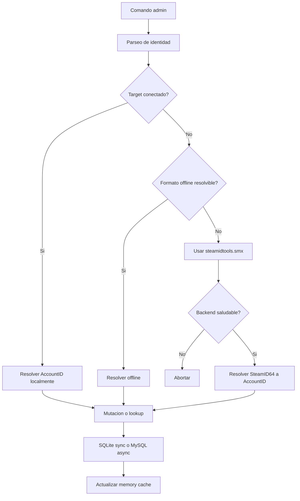
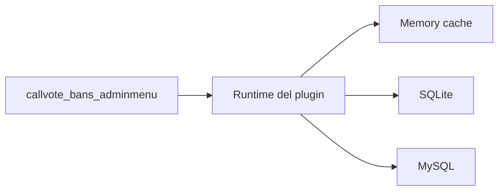

# CallVote Bans

Plugin basico de restricciones por tipo de votacion sobre `callvote_manager`.

## Alcance

`callvote_bans` se encarga de:

- bloquear votaciones cuando el jugador tiene una restriccion activa
- persistir restricciones por `AccountID`
- exponer una API simple para integraciones y herramientas administrativas externas

El plugin principal ya no incorpora paneles internos ni un sistema propio de razones. La capa administrativa puede vivir fuera del runtime base, por ejemplo en `callvote_bans_adminmenu`.

## Superficie publica

- comandos:
  - `sm_cvb_restrict`
  - `sm_cvb_unrestrict`
  - `sm_cvb_status`
- API:
  - `CVB_HasActiveRestriction`
  - `CVB_GetPlayerRestrictionMask`
  - `CVB_RestrictPlayer`
  - `CVB_RemoveRestriction`
  - `CVB_GetRestrictionInfo`
- admin menu externo:
  - `sm_cvb_restrict_panel`
  - `sm_cvb_unrestrict_panel`
  - `sm_cvb_status_panel`

## Modelo

El plugin sigue las mismas reglas que el resto de la suite:

- `AccountID` como identidad interna
- `SteamID2` solo para presentacion
- `SteamID64` persistido en MySQL para lectura externa y analitica
- SQLite local creado automaticamente por el plugin

Las conversiones offline usan `steamidtools.inc` y `steamidtools_helpers.inc`. Solo se usa el backend de `steamidtools.smx` cuando una operacion administrativa necesita resolver un `SteamID64` offline y el provider reporta estado saludable.

## Flujo

- los comandos administrativos usan un flujo unico para targets conectados e identidades offline
- SQLite ejecuta mutaciones en el mismo hilo del plugin
- MySQL ejecuta mutaciones y lecturas administrativas en forma asincrona
- el cache en memoria es solo un acelerador del runtime; la fuente de verdad es la base activa

## Direccion

`callvote_bans` debe mantenerse pequeno y estable. La logica de sanciones mas compleja, paneles avanzados y flujos mas ricos deberian crecer fuera de esta suite, consumiendo el core publico de `callvote_manager`.
