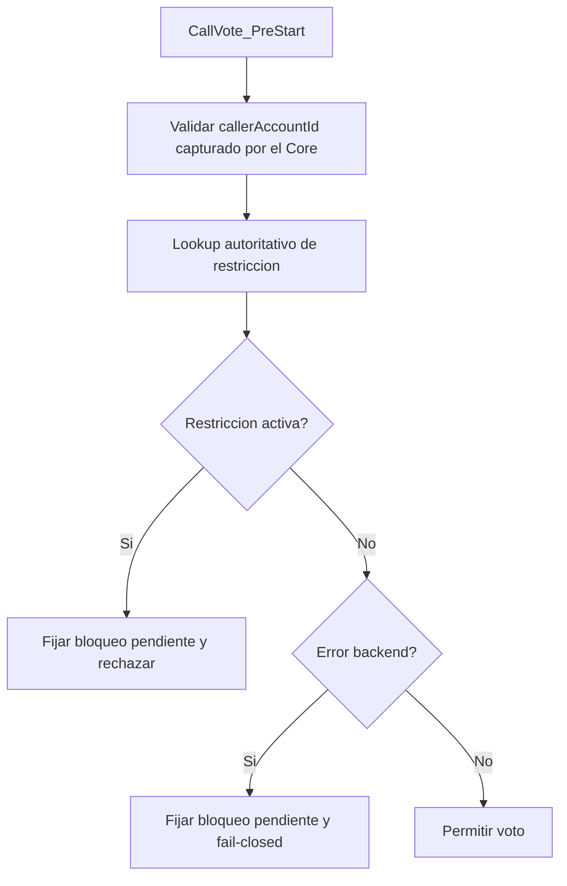
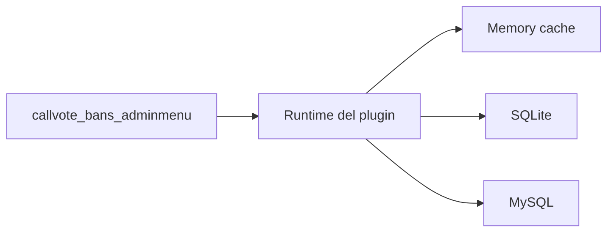
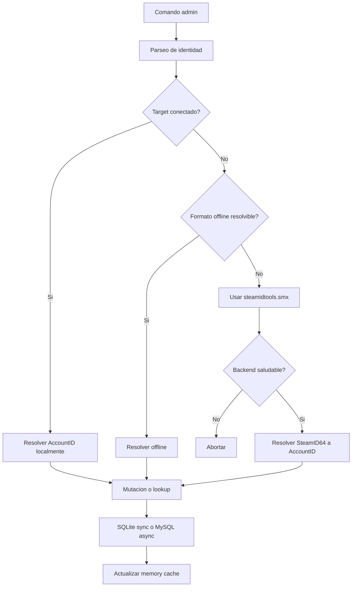

# CallVote Bans

Bans 2.1.0 y Admin Menu 1.1.0 consumen el contrato de `callvote_core` 3.0.0.
Bans aplica restricciones por tipo de votación; Admin Menu es su UI opcional.

## Alcance

`callvote_bans` se encarga de:

- bloquear votaciones cuando el jugador tiene una restriccion activa
- persistir restricciones por `AccountID`
- exponer una API simple para integraciones y herramientas administrativas externas

El plugin principal ya no incorpora paneles internos ni un sistema propio de razones. La capa administrativa puede vivir fuera del runtime base, por ejemplo en `callvote_bans_adminmenu`.

## Superficie publica

- comandos:
  - `sm_cvb_ban`
  - `sm_cvb_unban`
  - `sm_cvb_status`
- API:
  - `CVB_HasActiveRestriction`
  - `CVB_GetPlayerRestrictionMask`
  - `CVB_RestrictPlayer`
  - `CVB_RemoveRestriction`
  - `CVB_GetRestrictionInfo`
- admin menu externo:
  - `sm_cvb_ban_panel`
  - `sm_cvb_unban_panel`
  - `sm_cvb_status_panel`

## Dependencias y carga

El inventario inicial de bibliotecas se ejecuta una sola vez en
`OnAllPluginsLoaded`, también al cargar tarde. Bans inicializa entonces el cache
de los clientes ya conectados; Admin Menu enlaza el menú existente desde ese
mismo punto. Las altas y bajas posteriores actualizan la disponibilidad. Admin Menu difiere
el enlace del menú y la limpieza de paneles al siguiente frame; no consulta
natives al recibir el alta de una biblioteca.

Las solicitudes de identidad usan el estado de `steamidtools` y recorren sus
proveedores una sola vez, intentando el siguiente si el anterior no acepta la
solicitud. Se distinguen biblioteca ausente, proveedores no disponibles y fallo
al encolar. Los paneles consumen la entrada del comentario aunque sea inválida,
para que no aparezca en el chat público.

## Contrato con el Core

- `PreStart` decide sin enviar chat ni emitir `CVB_OnVoteBlocked` todavía.
- El AccountID capturado por el Core identifica al iniciador. No se sustituye
  por el ocupante actual del slot; una identidad ausente o distinta veta con
  `ClientState`. La política reutiliza restricciones activas del cache y, si no las encuentra,
  valida una sola vez contra el backend activo. Un backend ausente veta. Las
  mutaciones persistidas actualizan el cache; una lectura negativa almacenada
  no evita volver a validar la política.
- Bans conserva únicamente el veto pendiente y los detalles que lo causaron.
  `Blocked` presenta ese veto si coinciden sesión, identidad y motivo canónico.
  Otro motivo canónico descarta la presentación de Bans.
- Antes de notificar se revalidan los seriales de conexión y AccountID del
  iniciador y objetivo. El forward propio conserva su firma; un client que ya
  no representa la conexión capturada se entrega como 0. Los duplicados no
  repiten la notificación.
- `End`, fin de mapa, cambio de habilitación y descarga del Core limpian el veto.
  Esto no es un historial de votaciones ni añade persistencia al Core.
- Una consulta fallida mantiene el estado del jugador sin validar, en vez de
  marcarlo como listo. El native de restricciones inicializa siempre el
  AccountID del jugador antes del lookup.
- Las entradas del cache sólo se reutilizan si proceden del backend activo.
  Si MySQL conecta después de usar SQLite, se descarta la entrada SQLite y se
  consulta MySQL, tanto para restricciones activas como para resultados negativos.

## Paneles administrativos

Los paneles conservan `userid` y AccountID del objetivo y comprueban ambos antes
de enviar una mutación. Cada selección revalida la biblioteca y los permisos
actuales del administrador, incluidos los overrides de comandos. La descarga de
Bans y los cambios de mapa descartan los paneles pendientes.

Los natives de restricción y eliminación devuelven aceptación de la solicitud.
Admin Menu la presenta como **solicitud aceptada**, sin afirmar que ya se
persistió. Bans comunica el resultado al completar SQLite o MySQL; la conversión
Steam y el trabajo SQL permanecen en el satélite. La solicitud SQL captura el
AccountID del administrador; una desconexión antes de completar la persistencia
no cambia esa autoría a consola en el cache ni en los detalles.

## Modelo

El plugin sigue el [contrato de identidad del core](README_CORE.md#contrato-de-identidad)
y las mismas reglas que el resto de la suite:

- `AccountID` como identidad interna
- `SteamID2` solo para presentacion
- `SteamID64` persistido en MySQL para lectura externa y analitica
- SQLite local creado automaticamente por el plugin

Las conversiones offline usan `steamidtools.inc` y `steamidtools_helpers.inc`. Solo se usa el backend de `steamidtools.smx` cuando una operacion administrativa necesita resolver un `SteamID64` offline y el provider reporta estado saludable.

## Flujo

- `CallVote_PreStart` es el punto de validacion del runtime
- `CallVote_Blocked` permite observar rechazos desde el contrato comun del core
- `CallVote_End` limpia el veto pendiente de su sesión; no modifica restricciones persistidas
- los comandos administrativos usan un flujo unico para targets conectados e identidades offline
- SQLite ejecuta mutaciones en el mismo hilo del plugin
- MySQL ejecuta mutaciones y lecturas administrativas en forma asincrona
- el cache en memoria es solo un acelerador del runtime; la fuente de verdad es la base activa

```mermaid
flowchart TD
    A[CallVote_PreStart] --> B[Validar callerAccountId capturado por el Core]
    B --> C[Lookup autoritativo de restriccion]
    C --> D{Restriccion activa?}
    D -- Si --> E[Fijar bloqueo pendiente y rechazar]
    D -- No --> F{Error backend?}
    F -- Si --> G[Fijar bloqueo pendiente y fail-closed]
    F -- No --> H[Permitir voto]
```

```mermaid
flowchart LR
    Runtime[Runtime del plugin]
    Cache[Memory cache]
    SQLite[SQLite]
    MySQL[MySQL]
    AdminMenu[callvote_bans_adminmenu]

    Runtime --> Cache
    Runtime --> SQLite
    Runtime --> MySQL
    AdminMenu --> Runtime
```

```mermaid
flowchart TD
    A[Comando admin] --> B[Parseo de identidad]
    B --> C{Target conectado?}
    C -- Si --> D[Resolver AccountID localmente]
    C -- No --> E{Formato offline resolvible?}
    E -- Si --> F[Resolver offline]
    E -- No --> G[Usar steamidtools.smx]
    G --> H{Backend saludable?}
    H -- No --> I[Abortar]
    H -- Si --> J[Resolver SteamID64 a AccountID]
    D --> K[Mutacion o lookup]
    F --> K
    J --> K
    K --> L[SQLite sync o MySQL async]
    L --> M[Actualizar memory cache]
```

## Direccion

`callvote_bans` debe mantenerse pequeno y estable. La logica de sanciones mas compleja, paneles avanzados y flujos mas ricos deberian crecer fuera de esta suite, consumiendo el core publico de `callvote_core`.
