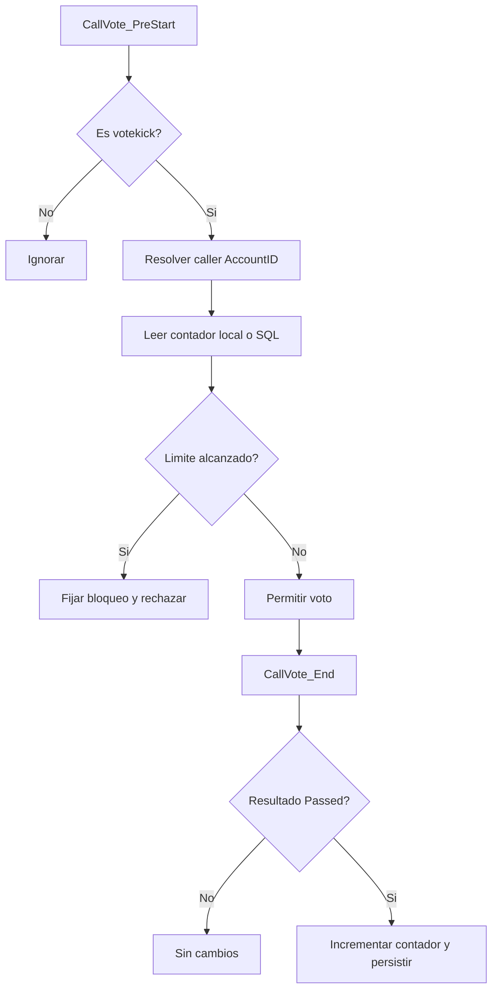
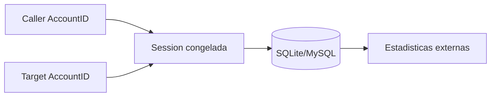

# CallVote Kick Limit

Extension del core orientada a limitar abuso en votekick.

## Rol

`callvote_kicklimit` no intercepta el motor por su cuenta. Se monta sobre la API publica de `callvote_core` y aplica una politica concreta:

- controlar cuantas votaciones de expulsión puede iniciar un jugador

## Integracion con el core

El plugin consume directamente el lifecycle de `callvote_core`, especialmente:

- `CallVote_PreStart` para validacion previa al inicio
- `CallVote_Blocked` para observar rechazos
- `CallVote_End` para reaccionar al resultado final

Eso evita reconstruir el estado del voto desde hooks dispersos del motor.

## Convencion publica

La superficie publica de `callvote_kicklimit` usa una sola convencion:

- comandos con prefijo `sm_cvkl_*`
- convars con prefijo `sm_cvkl_*`

## Modelo de identidad

Internamente trabaja con:

- `AccountID` para memoria y SQL

Y usa:

- `SteamID2` solo cuando necesita una representacion legible para logs o chat

## Persistencia

La persistencia registra:

- quien inicio el votekick
- contra quien fue dirigido
- cuando ocurrio

El esquema sigue la misma convencion del core:

- `caller_account_id`
- `target_account_id`
- `caller_steamid64` en MySQL
- `target_steamid64` en MySQL

`SteamID64` se guarda solo para lectura externa de estadisticas. El plugin sigue operando con `AccountID`.

SQLite se bootstrapea desde el plugin. MySQL se provisiona con scripts SQL. El motor activo se elige desde `databases.cfg`.

## Alcance

Este plugin resuelve una sola politica de negocio y no intenta convertirse en un subsistema general de sanciones o reputacion.

Su valor esta en que demuestra como extender el core sin acoplarse directamente a detalles del motor.

## Modelo de hooks

- `CallVote_PreStart` es el punto de decision donde `kicklimit` valida el contador.
- Si necesita bloquear, el plugin fija el motivo pendiente en el core y devuelve `Plugin_Handled`.
- `CallVote_End` usa la sesion congelada del core para persistir el resultado cuando el voto realmente paso.
