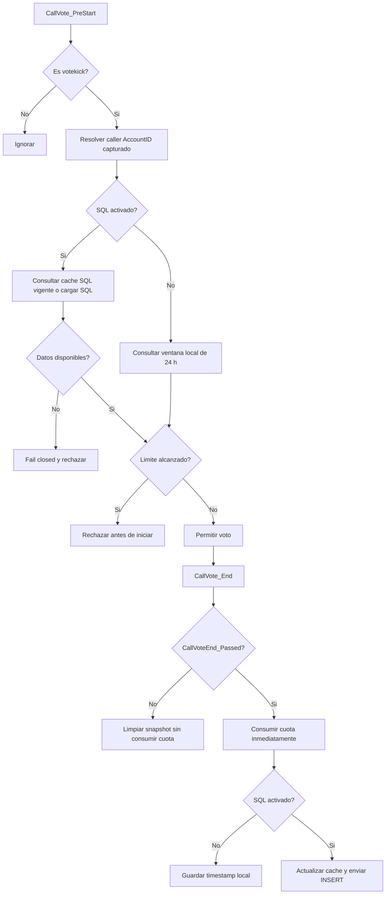

# CallVote Kick Limit

Extension del core orientada a limitar abuso en votekick. La cuota cuenta
votaciones de expulsión que fueron aprobadas; los intentos fallidos o
bloqueados no consumen cuota. La ventana es móvil de 24 horas.

## Rol e integración con el core

`callvote_kicklimit` consume la API pública de `callvote_core` y aplica la
política de cuota:

- `CallVote_PreStart` comprueba la cuota antes de iniciar un votekick.
- `CallVote_Blocked` limpia el snapshot de esa sesión cuando el core bloquea
  el voto.
- `CallVote_End` consume una unidad únicamente con `CallVoteEnd_Passed`.
  Resultados fallidos y bloqueados no cuentan.

El core entrega el índice de cliente y el `AccountID` capturados para la
sesión. La identidad usada para la cuota es el `AccountID`, no el slot actual
del jugador. La regla comun se describe en el
[contrato de identidad del core](README_CORE.md#contrato-de-identidad).

```mermaid
flowchart TD
    A[CallVote_PreStart] --> B{Es votekick?}
    B -- No --> C[Ignorar]
    B -- Si --> D[Resolver caller AccountID capturado]
    D --> E{SQL activado?}
    E -- No --> F[Consultar ventana local de 24 h]
    E -- Si --> G[Consultar cache SQL vigente o cargar SQL]
    G --> H{Datos disponibles?}
    H -- No --> I[Fail closed y rechazar]
    F --> J{Limite alcanzado?}
    H -- Si --> J
    J -- Si --> K[Rechazar antes de iniciar]
    J -- No --> L[Permitir voto]
    L --> M[CallVote_End]
    M --> N{CallVoteEnd_Passed?}
    N -- No --> O[Limpiar snapshot sin consumir cuota]
    N -- Si --> P[Consumir cuota inmediatamente]
    P --> Q{SQL activado?}
    Q -- No --> R[Guardar timestamp local]
    Q -- Si --> S[Actualizar cache y enviar INSERT]
```

## Configuración y comandos

Las convars del plugin son:

| ConVar | Predeterminado | Uso |
| --- | ---: | --- |
| `sm_cvkl_enable` | `1` | Activa o desactiva el plugin (`0` o `1`). |
| `sm_cvkl_kicklimit` | `1` | Máximo de votekicks aprobados por caller dentro de 24 horas; admite `0` o más. |
| `sm_cvkl_sql` | `0` | Usa almacenamiento SQL cuando vale `1`; en `0` usa memoria local. |
| `sm_cvkl_sql_config` | `callvote` | Nombre de la conexión en `databases.cfg`. |
| `sm_cvkl_debug_mask` | `0` | Máscara de depuración de `0` a `255`: Core=1, SQL=2, Cache=4, Commands=8, Identity=16, Forwards=32, Session=64, Localization=128; `255` activa todos. |
| `sm_cv_log_mode` | `0` | Modo de log compartido por la suite: `0` apagado, `1` normal, `2` debug. |

Comandos:

- `sm_cvkl_count <#userid|name>` muestra el contador al jugador conectado
  indicado; no requiere flag de admin.
- `sm_cvkl_show` lista los registros no nulos en memoria de jugadores humanos
  conectados. Requiere `ADMFLAG_KICK` y se ejecuta desde el chat del juego.
  Si algún contador sigue cargando o no puede validarse, indica que la lista
  está incompleta en lugar de afirmar que no hay registros.

## Política de cuota y memoria local

En modo memoria, cada `CallVoteEnd_Passed` agrega un timestamp al historial
del `AccountID`. La consulta cuenta únicamente entradas dentro de los últimos
24 horas exactos. Los registros viven por `AccountID`, así que sobreviven a la
desconexión y a los cambios de mapa durante la vida del plugin; se purgan por
antigüedad, no al abandonar el servidor. Un reinicio o recarga del plugin
vacía este historial local.

Con SQL desactivado, la cuota depende de esa memoria del proceso y no se
comparte entre servidores. Con `sm_cvkl_kicklimit 0`, el límite es cero: no se
permite iniciar votekicks.

## Modo SQL

Al activar `sm_cvkl_sql`, la base configurada es la autoridad para contar los
votekicks aprobados en la ventana de 24 horas. Cada consulta SQL aplica ese
filtro temporal. Una cache acotada de 60 segundos evita repetir consultas
recientes por `AccountID`; vence antes si el registro más antiguo alcanza las
24 horas. Al vencer, la cuota vuelve a requerir datos de SQL.

El modo SQL falla cerrado mientras la conexión o tabla no estén listas, o
mientras una carga esté pendiente o haya fallado: no usa el valor local como
fallback para autorizar un voto. Las conexiones y consultas se reintentan con
intervalos de 30 segundos. Al aprobarse un voto, la cuota/cache local se
incrementa de inmediato antes de enviar el `INSERT`, de modo que otra
comprobación del proceso vea el consumo sin esperar el callback.

Un fallo de inserción no se reenvía automáticamente: el resultado puede ser
ambiguo y repetirlo podría duplicar el registro. Por ello, esta política no
promete reintentos durables de inserciones ni recuperación garantizada de una
escritura fallida. La disponibilidad SQL es necesaria para autorizar nuevos
votos cuando no hay datos válidos en cache.
La cuota del evento fallido se conserva en memoria hasta cumplir 24 horas;
un reinicio del plugin puede perderla si SQL no guardó la fila. Si la escritura
quedó persistida pese a una respuesta de error, el conteo puede ser conservador
y sumar ese evento dos veces durante esa ventana.

SQLite crea su tabla e índice desde el plugin. MySQL requiere la tabla
provisionada por los scripts SQL del proyecto. El motor se elige desde
`databases.cfg`; `sm_cvkl_sql_config` selecciona la conexión. En MySQL el
plugin convierte localmente los `AccountID` capturados a `SteamID64` para
guardar las columnas analíticas. No consulta slots de jugador para reconstruir
la identidad después del voto.
Un objetivo sin AccountID, como un bot, conserva `target_account_id = 0` y
`target_steamid64 = '0'`; su expulsión aprobada también consume y persiste la
cuota del iniciador humano.

SQL permite compartir el historial entre instancias que consultan la misma
base, pero el conteo y la inserción no forman una operación atómica global.
Dos gameservers pueden aprobar votos concurrentes basándose en el mismo
conteo y superar temporalmente el límite combinado. Para garantizar una cuota
global estricta se requiere serialización/atomicidad en el almacenamiento, que
este plugin no implementa.

## Modelo de identidad y persistencia

El plugin usa `AccountID` para la cuota, la memoria y las columnas de SQL.
MySQL conserva además `caller_steamid64` y `target_steamid64` para lectura
analítica externa; SQLite conserva los AccountID y timestamps. La conversión
a `SteamID64` se realiza localmente desde los AccountID capturados, sin
consultar a jugadores que pudieron desconectarse.

Los comandos de consulta y los mensajes diferidos validan que el índice de
cliente siga asociado al `AccountID` capturado antes de mostrar datos. El slot
por sí solo no representa la identidad.

## Alcance

Este plugin resuelve la cuota de votekick aprobados y no es un subsistema
general de sanciones o reputación. Extiende el core a través de su API pública,
sin reconstruir el estado del voto desde hooks dispersos del motor.
