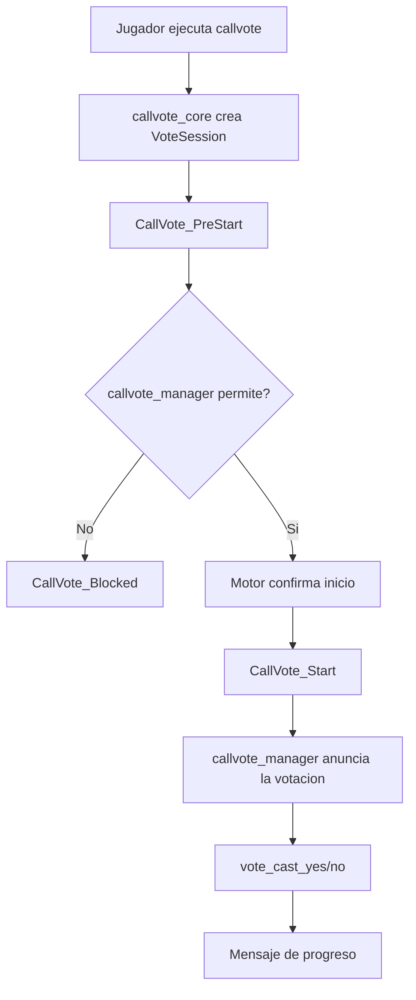

# CallVote Manager

Satelite de UX por defecto sobre `callvote_core`.

## Rol

`callvote_manager` ya no es el proveedor del lifecycle ni de la API publica. Ese rol ahora pertenece a `callvote_core`.

Su responsabilidad actual es:

- aplicar la politica por defecto en `CallVote_PreStart`
- anunciar votaciones aceptadas
- mostrar progreso `vote_cast_yes/no`
- ofrecer la experiencia base visible para jugadores

## Modelo actual

El satelite trabaja sobre tres ideas centrales del core:

- identidad canonica por `AccountID`
- presentacion derivada por `SteamID2`
- sesion de voto como unidad de contexto

Y sobre un modelo de hooks:

- `CallVote_PreStart`: pre-hook de politica
- `CallVote_Blocked`: post-hook de rechazo
- `CallVote_End`: post-hook final del lifecycle

La sesion concentra, como minimo:

- `sessionId`
- caller y target
- `callerAccountId` y `targetAccountId`
- `voteType`
- argumento bruto
- estado y resultado
- conteo observado de votos

## Flujo

De forma resumida, el flujo es:

1. `callvote_core` intercepta `callvote`
2. el core crea una sesion normalizada
3. `callvote_manager` consume `CallVote_PreStart` y aplica la politica por defecto
4. si nadie bloquea, el core entrega el comando al motor
5. si el motor confirma el inicio, dispara `CallVote_Start`
6. `callvote_manager` anuncia la votacion
7. durante el voto, consume `vote_cast_yes/no` para mostrar progreso

## Relacion con el core

El contrato publico vive en `callvote_core.inc`, no en este plugin.

El manager implementa la politica por defecto usando ese contrato. Si quieres una
suite sin esa politica, puedes deshabilitar `callvote_manager` y montar otro
consumidor sobre `callvote_core`.

## Convencion publica

La superficie publica del manager sigue una convencion unica:

- convars con prefijo `sm_cvm_*`

El manager ya no define el contrato base de sesion ni la API compartida.

## Alcance

- anuncios visibles del voto
- progreso visible del voto
- politica por defecto de inmunidades y validaciones visibles
- experiencia base de jugadores

## Estado del diseno

El manager ahora es un consumidor mas del core, igual que `kicklimit` o `bans`.
