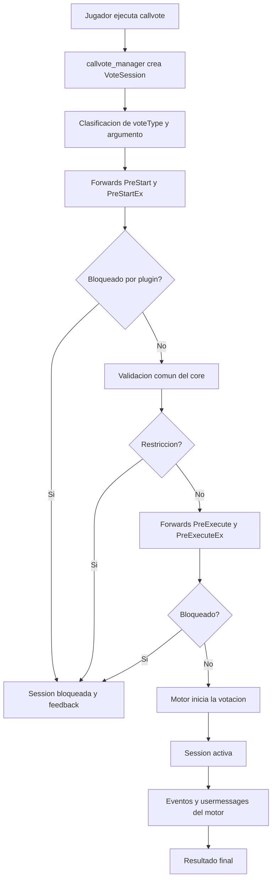
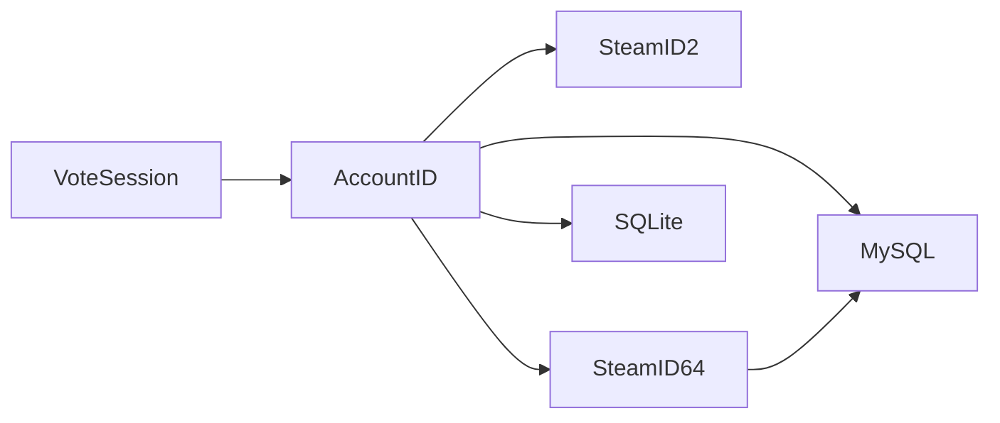

# CallVote Manager

Core de la suite y punto de integracion para plugins de votaciones.

## Rol

`callvote_manager` intercepta las votaciones antes de que queden en manos del motor, normaliza el tipo de voto y aplica la validacion comun del sistema.

Su responsabilidad no es sancionar ni imponer politicas de negocio especificas. Su responsabilidad es:

- construir contexto de votacion
- validar reglas base
- exponer un contrato estable
- registrar actividad

## Modelo actual

El core trabaja con tres ideas centrales:

- identidad canonica por `AccountID`
- presentacion derivada por `SteamID2`
- sesion de voto como unidad de contexto

La sesion concentra, como minimo:

- `sessionId`
- caller y target
- `callerAccountId` y `targetAccountId`
- `voteType`
- argumento bruto
- estado y resultado
- conteo observado de votos

## Flujo

De forma resumida, el flujo es:

1. un jugador ejecuta `callvote`
2. el core identifica el tipo y crea una sesion
3. corre validaciones comunes
4. expone hooks a plugins externos
5. si el motor confirma el inicio, la sesion pasa a activa
6. el core observa el cierre y publica el resultado final

## Contrato publico

El plugin expone dos niveles de contrato:

- contrato historico, mantenido por compatibilidad
- contrato `Ex`, orientado a `sessionId`, `AccountID` y lifecycle completo

La direccion del proyecto es que nuevas extensiones dependan del contrato `Ex`.

## Convencion publica

La superficie publica del manager sigue una convencion unica:

- comandos con prefijo `sm_cvm_*`
- convars con prefijo `sm_cvm_*`

La documentacion y los ejemplos deben referirse solo a esa nomenclatura.

## SQL

El almacenamiento persistente ya no usa `SteamID2` como identidad primaria.

El esquema actual usa:

- `caller_account_id`
- `target_account_id`
- `caller_steamid64` en MySQL
- `target_steamid64` en MySQL

`SteamID2` no se persiste como llave. Si hace falta mostrarlo, se deriva desde `AccountID`.

SQLite se instala automaticamente desde el plugin y mantiene un esquema minimo orientado al runtime local.

MySQL se instala solo mediante scripts SQL y agrega `SteamID64` para consumo externo y analitica.

## Alcance

Lo que pertenece al core:

- interceptacion
- validacion base
- contexto de sesion
- logging
- API para terceros

Lo que no pertenece al core:

- sanciones
- reglas administrativas complejas
- persistencia de bans
- UI o flujos propios de moderacion

## Estado del diseno

El core esta siendo consolidado como base para una suite externa de sanciones. Por eso el foco ya no esta en plugins satelite acoplados, sino en contratos claros y bajo acoplamiento.
