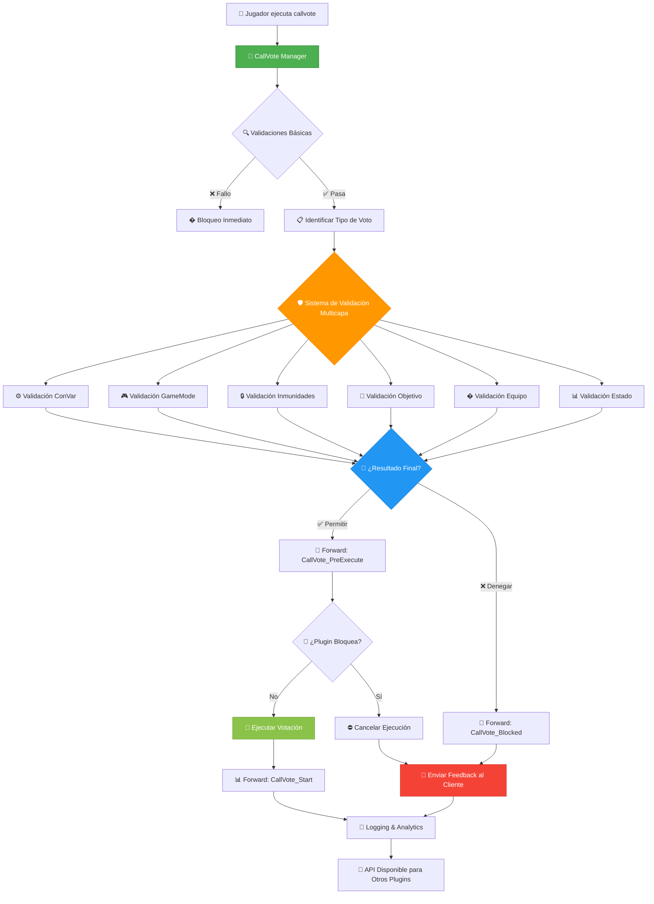

# 🎯 CallVote Manager - API Principal

[](../LICENSE)
[](https://www.sourcemod.net/)
[](https://store.steampowered.com/app/550/Left_4_Dead_2/)

**El núcleo central del CallVote Manager Suite - API y sistema de control avanzado de votaciones**

[🏠 Volver al índice principal](../README.md) | [🚫 CallVote Kick Limit](README_KICKLIMIT.md) | [🔒 CallVote Bans](README_BANS.md)

---

## � **Descripción General**

CallVote Manager es el **corazón del sistema** que actúa como API central para toda la gestión de votaciones en Left 4 Dead 2. Intercepta todas las votaciones antes de que lleguen al motor del juego, las valida a través de múltiples capas de restricciones, y proporciona una interfaz unificada para que otros plugins del ecosistema puedan integrar sus propias reglas de validación.

### **¿Qué hace exactamente?**

El plugin funciona como un **middleware inteligente** que:
- **Intercepta** todas las llamadas de votación (`callvote`) 
- **Valida** permisos, inmunidades y restricciones
- **Decide** si permitir o bloquear la votación
- **Registra** toda la actividad para análisis
- **Proporciona API** para que otros plugins extiendan la funcionalidad

---

## 🔄 **Flujo de Procesamiento**



---

## ✨ **Características Principales**

### 🎯 **Gestión Centralizada**
CallVote Manager actúa como el **punto único de control** para todas las votaciones del servidor, proporcionando consistencia y control granular sin fragmentar la lógica entre múltiples plugins.

### 🔧 **API Robusta para Desarrolladores**
Proporciona **forwards y natives** que permiten a otros plugins:
- Interceptar votaciones antes del procesamiento
- Añadir validaciones personalizadas
- Reaccionar a eventos de votación
- Consultar permisos y restricciones

### 🛡️ **Sistema de Inmunidades Inteligente**
- **Cache optimizado** de permisos administrativos
- **Inmunidades configurables** por tipo de votación
- **Soporte para múltiples flags** de administrador
- **Protección contra auto-kicks** accidentales

### 📊 **Logging y Analytics Avanzados**
- **Doble sistema** de logging (archivos + SQL)
- **Flags configurables** para registrar eventos específicos  
- **Estadísticas detalladas** con breakdown por tipo
- **Cleanup automático** de registros antiguos

### 🌍 **Localización Dinámica**
- **Integración con Language Manager** para traducciones en tiempo real
- **Nombres localizados** de campañas y capítulos
- **Soporte multiidioma** per-cliente
- **Fallbacks inteligentes** cuando faltan traducciones

---

## 🏗️ **Arquitectura del Sistema**

### **Capas de Validación**

1. **Capa de Entrada**: Interceptación de comandos callvote
2. **Capa de Parseo**: Identificación y clasificación del tipo de voto
3. **Capa de Validación**: Sistema multicapa de restricciones
4. **Capa de Ejecución**: Forwards para intervención de terceros  
5. **Capa de Logging**: Registro y analytics
6. **Capa de Integración**: API para otros plugins

### **Tipos de Restricciones**

| Tipo | Descripción | Ejemplo |
|------|-------------|---------|
| **ConVar** | Configuración del servidor | `sv_vote_issue_kick_allowed 0` |
| **GameMode** | Restricciones por modo de juego | Kick no permitido en Survival |
| **Immunity** | Protecciones especiales | Admin inmune a votekick |
| **SameState** | Evitar redundancia | AllTalk ya está enabled |
| **Team** | Restricciones de equipo | Solo Survivors pueden votar |
| **Target** | Validación de objetivo | Target no válido para kick |

### **Sistema de Forwards**

```sourcepawn
// Flujo completo de eventos para desarrolladores
CallVote_PreStart()    → Bloqueo preventivo antes de validación
CallVote_Start()       → Notificación de voto iniciado exitosamente  
CallVote_PreExecute()  → Última oportunidad de intervención
CallVote_Blocked()     → Información sobre bloqueos para analytics
```

---

## 🔗 **Integración con Otros Plugins**

CallVote Manager está diseñado para ser el **núcleo central** que otros plugins de la suite extienden:

### **CallVote Bans**
```sourcepawn
// Usa los forwards para aplicar bans de votación
public Action CallVote_PreStart(int client, TypeVotes voteType, int target) {
    if (IsClientBannedFromVoteType(client, voteType)) {
        return Plugin_Handled; // Bloquear
    }
    return Plugin_Continue;
}
```

### **CallVote Kick Limit** 
```sourcepawn
// Intercepta kicks para aplicar límites
public Action CallVote_PreStart(int client, TypeVotes voteType, int target) {
    if (voteType == Kick && HasExceededKickLimit(client)) {
        return Plugin_Handled; // Bloquear por límite
    }
    return Plugin_Continue;
}
```

---

## 🎮 **Casos de Uso**

### **Servidores Competitivos**
- Control estricto de votaciones durante matches
- Inmunidades para jugadores de equipos
- Logging detallado para análisis post-partida

### **Servidores Casuales**
- Prevención de griefing con votaciones
- Límites de kick para evitar abuso
- Anuncios localizados para mejor experiencia

### **Servidores de Comunidad**
- Restricciones personalizadas por roles
- Integración con sistemas VIP
- Analytics para moderar comportamiento

---

## 📥 **Instalación**

### **Archivos Requeridos**
```
addons/sourcemod/plugins/callvotemanager.smx
addons/sourcemod/translations/callvote_manager.phrases.txt
addons/sourcemod/translations/es/callvote_manager.phrases.txt
cfg/sourcemod/callvote_manager.cfg
```

### **Dependencias**
```
Requeridas:
- SourceMod 1.11+
- Left4DHooks
- Colors

Opcionales:
- BuiltinVotes (recomendado)
- Language Manager
- Campaign Manager  
- Confogl
```

### **Instalación Paso a Paso**

#### **1. Copiar Archivos**
```bash
# Copiar plugin compilado
cp callvotemanager.smx addons/sourcemod/plugins/

# Copiar traducciones
cp callvote_manager.phrases.txt addons/sourcemod/translations/
cp es/callvote_manager.phrases.txt addons/sourcemod/translations/es/

# Copiar configuración
cp callvote_manager.cfg cfg/sourcemod/
```

#### **2. Cargar Plugin**
```bash
# En consola del servidor
sm plugins load callvotemanager

# Verificar carga exitosa
sm plugins list | grep callvote
```

#### **3. Configurar Base de Datos** *(Opcional)*
```ini
# En addons/sourcemod/configs/databases.cfg
"callvote"
{
    "driver"    "mysql"
    "host"      "localhost"
    "database"  "sourcemod"
    "user"      "callvote_user"
    "pass"      "secure_password"
    "timeout"   "20"
    "port"      "3306"
}
```

#### **4. Instalar Tablas SQL** *(Si usas MySQL)*
```bash
# En consola del servidor
sm_cv_sql_install

# Verificar instalación
sm_cv_sql_stats
```

---

## ⚙️ **Configuración**

### **CVARs Principales**

#### **Control General**
```ini
# Activación del plugin
sm_cvm_enable "1"                    // Activar Call Vote Manager (0=off, 1=on)
```

#### **Anuncios y Notificaciones**
```ini
# Sistema de anuncios
sm_cvm_announcer "1"                 // Anunciar votaciones (0=off, 1=on)
sm_cvm_progress "1"                  // Mostrar progreso de votaciones (0=off, 1=on) 
sm_cvm_progressanony "0"             // Progreso anónimo (0=off, 1=on)
```

#### **Tipos de Votación**
```ini
# Habilitar/deshabilitar tipos específicos
sm_cvm_lobby "1"                     // Permitir votaciones ReturnToLobby (0=off, 1=on)
sm_cvm_chapter "1"                   // Permitir votaciones ChangeChapter (0=off, 1=on)
sm_cvm_alltalk "1"                   // Permitir votaciones ChangeAllTalk (0=off, 1=on)
```

#### **Sistema de Inmunidades**
```ini
# Configuración de inmunidades
sm_cvm_admininmunity ""              // Flags de admin inmunes (ejemplo: "b" para ADMFLAG_KICK)
sm_cvm_vipinmunity ""                // Flags VIP inmunes (ejemplo: "a" para ADMFLAG_RESERVATION)
sm_cvm_selfinmunity "1"              // Inmunidad a auto-kick (0=off, 1=on)
sm_cvm_botinmunity "1"               // Inmunidad para bots (0=off, 1=on)
sm_cvm_stvinmunity "1"               // Inmunidad para SourceTV (0=off, 1=on)
```

#### **Logging y Registro**
```ini
# Sistema de logs
sm_cvm_log "0"                       // Flags de logging local (ver tabla abajo)
sm_cvm_sql "0"                       // Flags de logging SQL (ver tabla abajo)
```

#### **Base de Datos**
```ini
# Configuración SQL
sm_cvm_cleanup_days "30"             // Días para mantener registros (1-365)
sm_cvm_master_server "0"             // Servidor maestro para limpieza automática (0=off, 1=on)
```

#### **Integración**
```ini
# Plugins opcionales
sm_cvm_builtinvote "1"               // Soporte BuiltinVotes (0=off, 1=on)
```

### **Flags de Logging**

Los flags de logging permiten registrar tipos específicos de votaciones:

| Valor | Tipo | Descripción |
|-------|------|-------------|
| `1` | Difficulty | Cambio de dificultad |
| `2` | RestartGame | Reiniciar juego |
| `4` | Kick | Expulsar jugadores |
| `8` | ChangeMission | Cambio de misión |
| `16` | ReturnToLobby | Volver al lobby |
| `32` | ChangeChapter | Cambio de capítulo |
| `64` | ChangeAllTalk | Cambio de AllTalk |
| `127` | ALL | Todos los tipos |

#### **Ejemplos de Configuración de Flags**
```ini
# Solo registrar kicks y cambios de misión
sm_cvm_log "12"          # 4 + 8 = 12

# Registrar todo excepto difficulty y alltalk  
sm_cvm_log "62"          # 127 - 1 - 64 = 62

# Registrar solo votaciones críticas (kick, restart, mission)
sm_cvm_sql "14"          # 2 + 4 + 8 = 14
```

### **Configuración Avanzada**

#### **Inmunidades por Flags**
```ini
# Ejemplos de configuración de inmunidades
sm_cvm_admininmunity "bcde"          // Admins con flags KICK, BAN, SLAY, MAP
sm_cvm_vipinmunity "a"               // VIPs solo con RESERVATION
sm_cvm_admininmunity ""              // Sin inmunidad administrativa
```

#### **Integración con Otros Plugins**
```ini
# Si tienes BuiltinVotes instalado
sm_cvm_builtinvote "1"

# Si usas Confogl en competitivo
# El plugin detecta automáticamente la presencia de Confogl
```

---

## 🎮 **Comandos**

### **Comandos de Administración**

#### **Gestión de Base de Datos**
| Comando | Nivel | Descripción |
|---------|-------|-------------|
| `sm_cv_sql_install` | ADMFLAG_ROOT | Instalar/actualizar tablas SQL |
| `sm_cv_sql_cleanup` | ADMFLAG_ROOT | Limpiar registros antiguos |
| `sm_cv_sql_truncate` | ADMFLAG_ROOT | Vaciar completamente las tablas |
| `sm_cv_sql_stats` | ADMFLAG_GENERIC | Ver estadísticas de base de datos |
| `sm_cv_sql_auto` | ADMFLAG_ROOT | Control de limpieza automática |

#### **Ejemplos de Uso**
```bash
# Instalar sistema SQL por primera vez
sm_cv_sql_install

# Ver estadísticas actuales
sm_cv_sql_stats

# Limpiar registros mayores a 30 días
sm_cv_sql_cleanup

# Habilitar limpieza automática
sm_cv_sql_auto enable

# Ver ayuda de comando específico
sm_cv_sql_auto help
```

### **Comandos de Usuario**
*Este plugin no incluye comandos para usuarios regulares - todo se maneja automáticamente.*

---

## ️ **Base de Datos**

### **Estructura de Tablas**

#### **Tabla: callvote_log**
```sql
CREATE TABLE `callvote_log` (
    `id` INT(11) NOT NULL AUTO_INCREMENT,
    `server_id` INT(11) DEFAULT 0,
    `timestamp` INT(11) NOT NULL,
    `map_name` VARCHAR(64) NOT NULL,
    `client_steamid` VARCHAR(32),
    `client_name` VARCHAR(64),
    `client_userid` INT(11),
    `vote_type` TINYINT(4) NOT NULL,
    `vote_type_name` VARCHAR(32) NOT NULL,
    `target_steamid` VARCHAR(32) DEFAULT NULL,
    `target_name` VARCHAR(64) DEFAULT NULL,
    `target_userid` INT(11) DEFAULT NULL,
    `result` ENUM('started', 'blocked', 'passed', 'failed') DEFAULT 'started',
    `block_reason` VARCHAR(128) DEFAULT NULL,
    `additional_data` TEXT DEFAULT NULL,
    PRIMARY KEY (`id`),
    KEY `idx_timestamp` (`timestamp`),
    KEY `idx_client_steam` (`client_steamid`),
    KEY `idx_vote_type` (`vote_type`),
    KEY `idx_server_time` (`server_id`, `timestamp`)
) ENGINE=InnoDB DEFAULT CHARSET=utf8mb4;
```

#### **Tabla: callvote_cleanup_control**
```sql
CREATE TABLE `callvote_cleanup_control` (
    `id` INT(11) NOT NULL AUTO_INCREMENT,
    `server_id` INT(11) NOT NULL,
    `last_cleanup` INT(11) NOT NULL,
    `cleanup_count` INT(11) DEFAULT 0,
    `is_master` TINYINT(1) DEFAULT 0,
    PRIMARY KEY (`id`),
    UNIQUE KEY `server_id` (`server_id`)
) ENGINE=InnoDB DEFAULT CHARSET=utf8mb4;
```

### **Configuración de Base de Datos**

#### **MySQL/MariaDB Recomendado**
```ini
# databases.cfg
"callvote"
{
    "driver"        "mysql"
    "host"          "localhost"
    "database"      "l4d2_callvote"
    "user"          "callvote_user"
    "pass"          "secure_password"
    "timeout"       "20"
    "port"          "3306"
    "encoding"      "utf8mb4"
}
```

#### **SQLite (Alternativa)**
```ini
# databases.cfg  
"callvote"
{
    "driver"        "sqlite"
    "database"      "callvote_logs"
    "timeout"       "20"
}
```

### **Mantenimiento de Base de Datos**

#### **Limpieza Automática**
```bash
# Configurar servidor maestro para limpieza automática
sm_cv_sql_auto enable

# Configurar días de retención
sm_cvm_cleanup_days 30

# Verificar estado de limpieza
sm_cv_sql_auto status
```

#### **Limpieza Manual**
```bash
# Limpiar registros antiguos
sm_cv_sql_cleanup

# Vaciar todas las tablas (¡CUIDADO!)
sm_cv_sql_truncate

# Ver estadísticas antes de limpiar
sm_cv_sql_stats
```

---

## 🛠️ **Solución de Problemas**

### **Problemas Comunes**

#### **❌ Plugin No Carga**
```bash
# Verificar dependencias
sm exts list | grep -E "(DBI|MySQL)"

# Verificar archivos
ls -la addons/sourcemod/plugins/callvotemanager.smx
ls -la addons/sourcemod/translations/callvote_manager.phrases.txt

# Revisar logs de error
tail -f logs/errors_*.log | grep callvote
```

#### **❌ Base de Datos No Conecta**
```bash
# Verificar configuración
sm_cv_sql_stats

# Probar conexión manual
sm_sql_test callvote

# Revisar logs SQL
tail -f logs/errors_*.log | grep -i mysql
```

#### **❌ Votaciones No Se Registran**
```bash
# Verificar flags de logging
sm_cvar sm_cvm_log
sm_cvar sm_cvm_sql

# Verificar permisos de archivos
ls -la logs/callvote/

# Probar manualmente
sm_cv_sql_install
```

#### **❌ Inmunidades No Funcionan**
```bash
# Verificar configuración de flags
sm_cvar sm_cvm_admininmunity
sm_cvar sm_cvm_vipinmunity

# Verificar permisos del admin
sm_who

# Probar con admin conocido
sm_admin_add_flag <steamid> b    # Flag de KICK
```

### **Diagnóstico Avanzado**

#### **Modo Debug**
```ini
# Activar debug en callvote_manager.cfg
sm_cvm_debug "1"

# O temporalmente en consola
sm_cvar sm_cvm_debug 1
```

#### **Verificación de Estado**
```bash
# Estado general del plugin
sm plugins info callvotemanager

# CVARs actuales
sm_cvar_list | grep cvm

# Bases de datos configuradas  
sm_database_list

# Estadísticas SQL
sm_cv_sql_stats
```

#### **Logs Detallados**
```bash
# Ver logs de votaciones
tail -f logs/callvote/votes_$(date +%Y-%m-%d).log

# Ver logs de errores
tail -f logs/errors_$(date +%Y%m%d).log

# Ver logs SQL específicos
tail -f logs/callvote_sql.log
```

### **Rendimiento y Optimización**

#### **Configuración Optimizada**
```ini
# Para servidores de alto tráfico
sm_cvm_sql "127"              # Log todo a SQL
sm_cvm_log "0"                # Deshabilitar logs locales
sm_cvm_cleanup_days "7"       # Retención corta
sm_cvm_master_server "1"      # Limpieza automática
```

#### **Monitoreo de Rendimiento**
```bash
# Ver estadísticas de base de datos
sm_cv_sql_stats

# Monitorear tamaño de tablas
mysql> SELECT table_name, 
       ROUND(((data_length + index_length) / 1024 / 1024), 2) AS 'Size (MB)'
       FROM information_schema.tables 
       WHERE table_schema = 'l4d2_callvote';
```

---

## � **Para Desarrolladores**

La API completa de CallVote Manager está documentada en los archivos include:

- **[callvotemanager.inc](../addons/sourcemod/scripting/include/callvotemanager.inc)** - Forwards y natives principales
- **[callvote_stock.inc](../addons/sourcemod/scripting/include/callvote_stock.inc)** - Enums y funciones utility

### **API Básica**
```sourcepawn
#include <callvotemanager>

// Verificar permisos de votación
bool CallVoteManager_IsVoteAllowedByConVar(TypeVotes voteType);
bool CallVoteManager_IsVoteAllowedByGameMode(TypeVotes voteType);

// Forwards para interceptar eventos
forward Action CallVote_PreStart(int client, TypeVotes voteType, int target);
forward void CallVote_Start(int client, TypeVotes voteType, int target);
forward Action CallVote_PreExecute(int client, TypeVotes voteType, int target);
forward void CallVote_Blocked(int client, TypeVotes voteType, VoteRestrictionType restriction, int target);
```

**[📖 Ver documentación completa en include files →](../addons/sourcemod/scripting/include/)**

---

## �📊 **Estadísticas y Logs**

### **Formato de Logs Locales**

#### **Archivo: logs/callvote/votes_YYYY-MM-DD.log**
```
[2025-01-02 15:30:45] [VOTE START] Player "TestUser" (STEAM_0:1:12345) initiated ChangeMission vote on de_dust2
[2025-01-02 15:30:50] [VOTE BLOCKED] Player "Griefer" (STEAM_0:1:67890) kick vote blocked - target has immunity
[2025-01-02 15:31:15] [VOTE SUCCESS] ChangeMission vote passed - switching to c1m1_hotel
```

### **Consultas SQL Útiles**

#### **Estadísticas por Tipo de Votación**
```sql
SELECT 
    vote_type_name,
    COUNT(*) as total_votes,
    SUM(CASE WHEN result = 'passed' THEN 1 ELSE 0 END) as passed,
    SUM(CASE WHEN result = 'blocked' THEN 1 ELSE 0 END) as blocked,
    ROUND(SUM(CASE WHEN result = 'passed' THEN 1 ELSE 0 END) * 100.0 / COUNT(*), 2) as success_rate
FROM callvote_log 
WHERE timestamp > UNIX_TIMESTAMP(DATE_SUB(NOW(), INTERVAL 7 DAY))
GROUP BY vote_type_name
ORDER BY total_votes DESC;
```

#### **Jugadores Más Activos en Votaciones**
```sql
SELECT 
    client_name,
    client_steamid,
    COUNT(*) as total_votes,
    COUNT(DISTINCT DATE(FROM_UNIXTIME(timestamp))) as active_days
FROM callvote_log 
WHERE timestamp > UNIX_TIMESTAMP(DATE_SUB(NOW(), INTERVAL 30 DAY))
GROUP BY client_steamid
ORDER BY total_votes DESC
LIMIT 10;
```

#### **Mapas con Más Actividad de Votaciones**
```sql
SELECT 
    map_name,
    COUNT(*) as total_votes,
    COUNT(DISTINCT client_steamid) as unique_voters
FROM callvote_log 
WHERE timestamp > UNIX_TIMESTAMP(DATE_SUB(NOW(), INTERVAL 7 DAY))
GROUP BY map_name
ORDER BY total_votes DESC;
```

### **Interpretación de Estadísticas**

#### **Métricas Clave**
- **Success Rate**: % de votaciones exitosas vs bloqueadas
- **Vote Frequency**: Votaciones por hora/día
- **User Activity**: Distribución de votaciones por usuario
- **Map Impact**: Mapas que generan más votaciones

#### **Alertas Recomendadas**
- **Alto Block Rate** (>70%): Posibles configuraciones muy restrictivas
- **Spam Detection**: Más de 10 votaciones por usuario en 5 minutos
- **Map Issues**: Mapas con >80% de votaciones de cambio

---

**[🏠 Volver al índice principal](README.md) | [🚫 Siguiente: CallVote Kick Limit →](README_KICKLIMIT.md)**

---

*Plugin desarrollado por **lechuga16** - Parte del CallVote Manager Suite*
